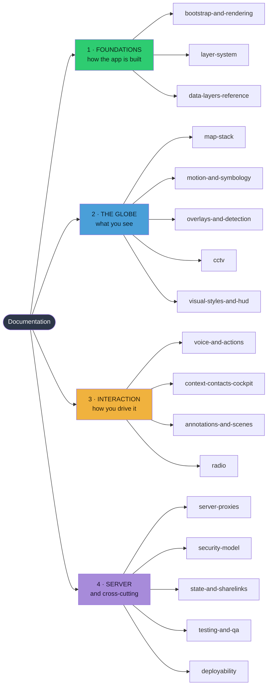

# Documentation Map

Subsystem-by-subsystem documentation of God's Eye View as it exists in this tree.
**Start here** — this page is the map; every other file is a territory.

---

## How this relates to the repo's own docs

The repository ships its own documentation. **Those remain authoritative.** This
folder is a navigable engineering view over them and over the source. Where they
disagree, they win.

| Repo doc | Role | When to reach for it |
|---|---|---|
| [`docs/CURRENT-STATE.md`](../docs/CURRENT-STATE.md) | **Authoritative runtime reference** | Any question of "what does it actually do". ~1,550 lines of reverse-chronological changelog, then the structured reference from **line 1557** |
| [`docs/KNOWN-ISSUES.md`](../docs/KNOWN-ISSUES.md) | Open + closed issues | Before filing a bug — it may be deliberate |
| [`docs/PERFORMANCE.md`](../docs/PERFORMANCE.md) | Cold-start, frame budgets | Perf work |
| [`docs/opensky-auth.md`](../docs/opensky-auth.md) | OpenSky auth modes | Flights auth |
| [`SECURITY.md`](../SECURITY.md) | Threat model | Anything touching keys or sharing |
| [`DATA_SOURCES.md`](../DATA_SOURCES.md) | Per-source licensing | **Before shipping or redistributing anything** |
| [`CONTRIBUTING.md`](../CONTRIBUTING.md) · [`TESTING.md`](../TESTING.md) | Process | Sending changes |
| [`CHANGELOG.md`](../CHANGELOG.md) | Release history | Dating a behaviour |

`CURRENT-STATE.md` declares its own canonical order — itself, then
`opensky-auth.md`, then `CHANGELOG.md` — and carries a maintenance rule: *runtime or
architecture changes update that file in the same change set as the code.* These
documents are downstream of it.

---

## The map

New to the codebase? Read in group order — **1 → 2 → 3**, with **4** as reference.

### Cross-links worth knowing

The groups are not sealed. These five pairs explain each other, and reading one
without the other leaves a gap:

| This doc | …explains something in | The connection |
|---|---|---|
| [layer-system](layer-system.md) | [radio](radio.md) | Radio is the concrete instance of every abstract lifecycle rule |
| [layer-system](layer-system.md) | [state-and-sharelinks](state-and-sharelinks.md) | Lifecycle epochs are what the restore lanes arbitrate |
| [bootstrap-and-rendering](bootstrap-and-rendering.md) | [overlays-and-detection](overlays-and-detection.md) | Render-governor holds decide when the overlay repaints |
| [server-proxies](server-proxies.md) | [security-model](security-model.md) | The proxies exist so keys stay server-side |
| [security-model](security-model.md) | [deployability](deployability.md) | The framing headers are why it cannot be iframed |

---

## Sections

### Foundations — read these first

| Doc | Covers | Key takeaway |
|---|---|---|
| **[bootstrap-and-rendering.md](bootstrap-and-rendering.md)** | Startup order, Cesium viewer construction, first-run launcher, the idle render governor | Nothing fetches before a mission tile is clicked. The governor flips Cesium into `requestRenderMode` when nothing animates — **discrete mutations must call `governorRequestRender()`** |
| **[layer-system.md](layer-system.md)** | `DataLayerManager`, lifecycle vocabulary, intent epochs, presentation gate, feed health | Four states **plus an uncertainty bit**. Only the latest request may publish settled visibility |
| **[data-layers-reference.md](data-layers-reference.md)** | Every layer: source, module, proxy, cadence — plus the fidelity taxonomy | Measured vs propagated vs interpolated vs **modeled**. The traffic dots are not vehicles |

### The globe

| Doc | Covers | Key takeaway |
|---|---|---|
| **[map-stack.md](map-stack.md)** | Five basemaps, availability ladder, switching contract | **The lit tile follows controller state, not the click** |
| **[motion-and-symbology.md](motion-and-symbology.md)** | Interpolation, dead reckoning, world-stable icons, ground datum, framing gates | The one-interval display latency is **intentional — do not "fix" it** |
| **[overlays-and-detection.md](overlays-and-detection.md)** | Shared overlay host, label arbitration, detection density, theming | An automatic default may be overwritten by automation; a **user choice may not** |
| **[cctv.md](cctv.md)** | Frustum projection, tri-state coverage, viewshed volumes, calibration gizmo | Positions are published and real; **poses are estimated priors** |
| **[visual-styles-and-hud.md](visual-styles-and-hud.md)** | Six GLSL shaders, bloom versioning, HUD variants, UI shell and rail rules | A default has **three surfaces** and a parse fallback that is not one of them |

### Interaction

| Doc | Covers | Key takeaway |
|---|---|---|
| **[voice-and-actions.md](voice-and-actions.md)** | Realtime token flow, session defaults, all 28 tools, cost governance, cancellation | The key never reaches the browser. Context stays short because **map state is fetched live per turn** |
| **[context-contacts-cockpit.md](context-contacts-cockpit.md)** | Context coordinator, Contacts vs Space Missions, track adoption, cockpit + briefing strip | **Disabling Context releases only what Context enabled** |
| **[annotations-and-scenes.md](annotations-and-scenes.md)** | Whiteboard engine, type-aware resolver, renderer split, scene director | Ambiguous results are rejected — **a wrong outline is worse than none** |
| **[radio.md](radio.md)** | Atomic catalog admission, generations, tuner drag, playback ownership, clusters | **The strictest state contract in the app.** Read it to learn the concurrency conventions |

### Server and cross-cutting

| Doc | Covers | Key takeaway |
|---|---|---|
| **[server-proxies.md](server-proxies.md)** | ~20 middleware proxies, shared modules, failover / caching / budget patterns | `vite.config.js` **is the server**, not a build config |
| **[security-model.md](security-model.md)** | Key custody, admission gate, framing, SSRF, sharing | Sharing **disables** the settings surface rather than trusting the socket |
| **[state-and-sharelinks.md](state-and-sharelinks.md)** | Share-link v2, the lane model, storage keys and versions | Restore ownership splits by lane — a newer action supersedes **only the field it owns** |
| **[testing-and-qa.md](testing-and-qa.md)** | Unit suite, boundary test, track regression, browser proofs, L9 matrix, tooling | A `npm test` total quoted **without its Node major is not comparable** |
| **[deployability.md](deployability.md)** | Running it on its own port behind a platform | `X-Frame-Options: DENY` on every response — **you cannot iframe it** |

---

## Reading paths

Pick the row that matches what you're doing.

| Task | Read, in order |
|---|---|
| **New to the codebase** | [bootstrap-and-rendering](bootstrap-and-rendering.md) → [layer-system](layer-system.md) → [data-layers-reference](data-layers-reference.md) → [radio](radio.md) *(as the worked example)* |
| **Adding a data layer** | [layer-system](layer-system.md) *(checklist at the end)* → [server-proxies](server-proxies.md) *(checklist at the end)* → [state-and-sharelinks](state-and-sharelinks.md) *(serialization disposition)* → [`DATA_SOURCES.md`](../DATA_SOURCES.md) |
| **A layer won't load** | [layer-system](layer-system.md) *(feed health)* → [server-proxies](server-proxies.md) → check the server log; proxies sanitize what reaches the browser |
| **Traffic won't load** | [data-layers-reference](data-layers-reference.md) — it needs **two** feeds; check `/api/overpass` before suspecting TomTom |
| **Something renders stale or not at all** | [bootstrap-and-rendering](bootstrap-and-rendering.md) — a missing `governorRequestRender()` is the classic cause |
| **Touching tracking or the camera** | [motion-and-symbology](motion-and-symbology.md) → [context-contacts-cockpit](context-contacts-cockpit.md) → then run `npm run test:track` |
| **Adding a voice tool** | [voice-and-actions](voice-and-actions.md) → [layer-system](layer-system.md) *(cancellation + epochs)* |
| **Changing a default** | [visual-styles-and-hud](visual-styles-and-hud.md) *(three surfaces)* → [state-and-sharelinks](state-and-sharelinks.md) *(what old links decode to)* |
| **Anything touching keys** | [security-model](security-model.md) → [`SECURITY.md`](../SECURITY.md) |
| **Hosting or integrating it** | [deployability.md](deployability.md) → [security-model](security-model.md) → [`DATA_SOURCES.md`](../DATA_SOURCES.md) |
| **Before opening a PR** | [testing-and-qa](testing-and-qa.md) → [`CONTRIBUTING.md`](../CONTRIBUTING.md) → update `CURRENT-STATE.md` in the same change set |

---

## Where things live

Where to look in the tree, and which document explains it.

| Subsystem | Primary source | Doc |
|---|---|---|
| Entry, viewer, registration | `src/main.js` | [bootstrap-and-rendering](bootstrap-and-rendering.md) |
| Render mode | `src/renderGovernor.js` | [bootstrap-and-rendering](bootstrap-and-rendering.md) |
| UI shell, styles, control facade | `src/ui.js` *(10,310 lines)* | [visual-styles-and-hud](visual-styles-and-hud.md) |
| Layer orchestration | `src/data/manager.js` | [layer-system](layer-system.md) |
| Layer serialization | `src/data/layerState.js`, `src/sharelink.js` | [state-and-sharelinks](state-and-sharelinks.md) |
| Basemaps | `src/mapStackController.js`, `src/mapStackChips.js` | [map-stack](map-stack.md) |
| Flights | `src/data/flights.js` *(5,338)*, `militaryFlights.js` | [data-layers-reference](data-layers-reference.md), [motion-and-symbology](motion-and-symbology.md) |
| Vessels | `src/data/aisLiveVessels.js`, `aisStreamAdapter.js` | [data-layers-reference](data-layers-reference.md) |
| Traffic | `src/data/traffic.js`, `flowTiles.js`, `flowMatch.js`, `trafficFlowStyle.js` | [data-layers-reference](data-layers-reference.md) |
| CCTV | `src/data/cctv.js` *(4,825)*, `cctvGizmo.js`, `cctvViewshed.js` | [cctv](cctv.md) |
| Radio | `src/data/radio.js` *(2,876)* | [radio](radio.md) |
| Satellites, launches | `src/data/satellites.js`, `rocketLaunches.js` | [data-layers-reference](data-layers-reference.md) |
| Overlays, labels | `src/overlays/`, `src/data/labelArbiter.js` | [overlays-and-detection](overlays-and-detection.md) |
| Detection | `src/data/detection.js`, `detectionDraw.js`, `detectionCohort.js` | [overlays-and-detection](overlays-and-detection.md) |
| HUD | `src/hud.js`, `src/hudSummaryResponse.js` | [visual-styles-and-hud](visual-styles-and-hud.md) |
| Shaders | `src/styles/`, `src/bloom.js` | [visual-styles-and-hud](visual-styles-and-hud.md) |
| Voice | `src/voice/` | [voice-and-actions](voice-and-actions.md) |
| Annotations | `src/annotations/` | [annotations-and-scenes](annotations-and-scenes.md) |
| Scenes | `src/scenes/` | [annotations-and-scenes](annotations-and-scenes.md) |
| Contacts, cockpit | `src/data/militaryAwareness.js`, `src/cockpit*.js` | [context-contacts-cockpit](context-contacts-cockpit.md) |
| **All server endpoints** | `vite.config.js` *(7,741 lines)* | [server-proxies](server-proxies.md) |
| Key setup | `src/keySetupCore.mjs`, `keySetupHardening.mjs`, `src/keySetup.js` | [security-model](security-model.md) |
| Bundled data | `src/data/local_data/`, `localGeojson.js`, `retryableLoad.js` | [layer-system](layer-system.md) |

---

## Commands

| Command | Purpose |
|---|---|
| `npm run doctor` | Environment + provider readiness. **Run this first when something is wrong** |
| `npm run dev` | Dev server on `localhost:4173` — the only mode where every proxy is live |
| `npm test` | Unit suite, 165 files |
| `npm run test:track` | Headless tracking / model / detection invariants |
| `npm run qa:map-source-tray` | Browser proof of the Map Source tray *(both keyed and `-- --keyless` are gates)* |
| `node scripts/qa-l9-matrix.mjs --url …` | Full release-candidate matrix |
| `npm run build` | Build gate — **note it drops the proxies**; see [deployability](deployability.md) |

---

## Codebase conventions

Two patterns recur everywhere and are worth internalizing before changing anything.

**Pure logic is split out and unit-tested.** Cesium-dependent rendering stays in the
layer module; decisions move to a Cesium-free sibling with a `.test.mjs` beside it.
`trafficFlowStyle.js` (thresholds, colours) versus `traffic.js` (primitives) is the
clearest pair. 165 test files enforce this. A missing test is a gap, not a norm.

**Failure degrades, never throws.** A malformed upstream response must not kill the
scene: one bad tile feature is skipped rather than dropping the tile; non-finite
congestion renders as free-flow rather than a phantom jam; a bundled dataset that
fails to load reports `UNAVAILABLE` rather than showing green over an empty globe.
Defensive `continue`s are usually load-bearing.

**Read the module header before changing behaviour.** The source carries unusually
good `@file` docblocks, and many encode *invariants with rationale* — why a value is
what it is, and what broke when it wasn't. Those comments are the record of field
findings you would otherwise rediscover the hard way.

---

## Conventions in these documents

- Claims are grounded in a file, a line, or `CURRENT-STATE.md`. Where something was
  inferred rather than verified, the text says so.
- Line references drift as the code moves. If one looks wrong, **trust the code** and
  fix the reference.
- Network findings carry dates — upstream availability changes.

---

## For Claude Code

Claude Code auto-loads **[`CLAUDE.md`](../CLAUDE.md) at the repo root**, not this
file. That is where the working rules live; this section is the short version, and
the two should be kept in step.

**How to use this documentation:**

1. **Locate before reading.** Use the [reading paths](#reading-paths) and the
   [where things live](#where-things-live) table to find the one or two
   relevant files. These documents are dense; reading them all is rarely the fastest
   route to an answer.
2. **Treat `docs/CURRENT-STATE.md` as authoritative.** This folder is a view over it.
   Where they disagree, it wins — and it may simply be newer.
3. **Verify line references before relying on them.** They drift as code moves. If a
   cited line looks wrong, trust the code and correct the reference.

**How to interpret the application:**

- **Assume intent.** This codebase records *why* — in module headers, in
  `CURRENT-STATE.md`, and in the invariant tables here. Behaviour that looks like a
  bug is often a documented decision with a field finding behind it. The one-interval
  flight latency and the detection-override gate are the classic examples.
- **Distinguish measured from modeled.** The app has the visual grammar of a
  classified feed, but only some of it is observation. Before reasoning about what a
  layer *means*, check the fidelity taxonomy in
  [data-layers-reference.md](data-layers-reference.md) — the traffic dots are not
  vehicles, and their `VEH-####` labels are array indices.
- **Expect concurrency to be explicit.** Lifecycle epochs, ownership tokens,
  presentation gates, and restore lanes are pervasive and load-bearing. If a change
  seems to need only a simple boolean, check [layer-system.md](layer-system.md) first.

**When you change something:** update `docs/CURRENT-STATE.md` in the same change set,
and update the file here that describes it.
