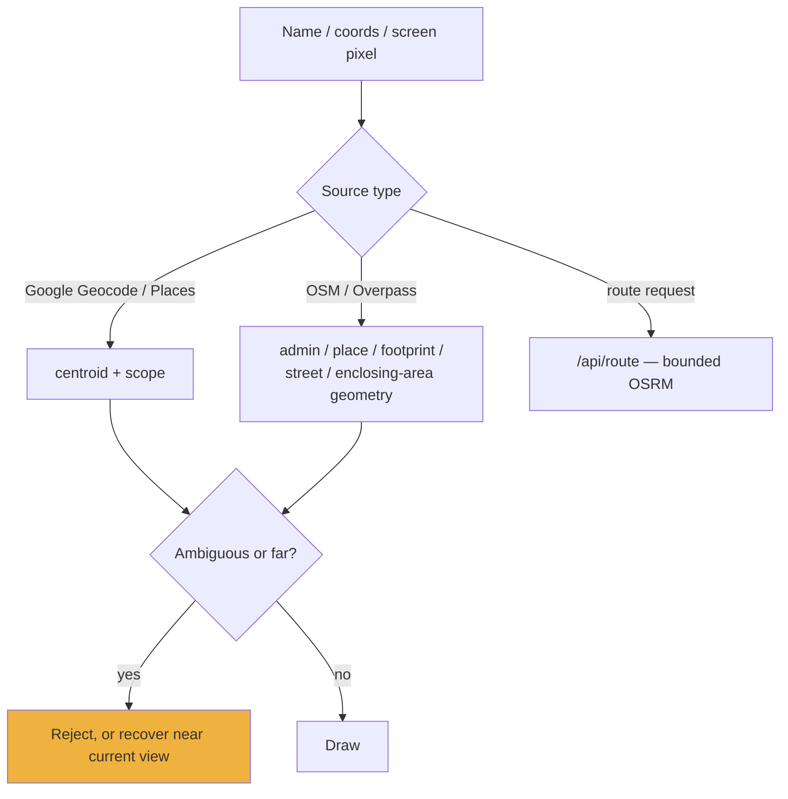
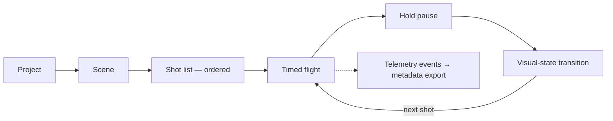

# Annotations and Scenes

Two authoring surfaces: a voice-driven whiteboard over the real world, and a
deterministic camera director for capture.

---

# Part 1 — Annotations

`src/annotations/` — the voice agent's whiteboard. Runtime entry is `src/main.js`
calling `initAnnotations({ viewer, tileset })`, which exposes `window.__gevAnnotations`
and passes the engine into the voice action runner.

| Module | Lines | Contract |
|---|---|---|
| `annotationEngine.js` | 1,138 | State, TTL/fade lifecycle, concurrency, dedupe, cancellation, cap |
| `annotationResolver.js` | 1,948 | Names / coords / screen pixels → world anchors + geometry |
| `hybridAnnotationRenderer.js` | — | Routes geometry to world-space or screen-space |
| `screenAnnotationRenderer.js` | 674 | SVG reticles, pins, arrows, callouts |

## Engine

Owns annotation state, TTL/fade lifecycle, concurrent anchor resolution, duplicate
detection **keyed on geometry**, cancellation on clear or newer generations, and a
hard cap of **120 live marks**.

Deferred outline upgrades drain FIFO at **concurrency 2**. Queued work retains the
owning abort controller and is discarded on a generation change *before it can
fetch* — a cancelled generation must not spend an Overpass request.

## Resolver — the hard part

Converting "the Texas State Capitol and its grounds" into real geometry. The
resolver is **type-aware**:



**Ambiguous or far results are rejected or recovered near the current view rather
than drawing misleading blobs.** That is the guiding principle — a wrong outline is
worse than no outline.

### Scope gating

Only explicitly country/state/county-scoped asks bypass near-view recovery and
proximity gating. And "state" scope is deliberately narrow:

| Phrase | Treated as state scope? |
|---|---|
| `state of Texas` / `the state of Texas` | ✅ |
| `Texas` (bare name) | ❌ still guarded |
| A proper name ending in "State" | ❌ still guarded |
| An administrative geocode result type *alone* | ❌ still guarded |

The leading-phrase requirement exists because bare names and "…State" proper nouns
are common false positives.

### Throttle handling

Overpass throttles are **distinct from normal transients**: `Retry-After` is honoured
for exactly one retry, and a repeated throttle ends only *that mark's* outline
upgrade — not the batch, and not the engine.

## Renderer split

`hybridAnnotationRenderer.js` routes draped `area`/`route` geometry to **world-space
Cesium** rendering, and reticles/pins/arrows/callouts to the **screen-space SVG**
renderer.

Area labels are screen-space callouts **so all captions share one visual language**.
Progressive outline upgrades convert the existing screen group in place when the
anchor snaps to the resolved centroid — the label does not jump.

## Behaviour

Annotations **accumulate and persist by default**; clearing is explicit only
(`clear_annotations`, or "clear the map"). Partial failures, approximate synthesized
zones, and route fallbacks return as structured tool results so voice can be honest.

## Test surface without a mic

```js
window.__gevAnnotations.tour()      // deterministic walkthrough
window.__gevAnnotations.demo()
window.__gevAnnotations.annotate()
window.__gevAnnotations.clear()
window.__gevAnnotations.count()
window.__gevAnnotations.list()
```

## Known gap

Mall and lifestyle districts — "The Domain, Austin" — can prefer a named building
over the broader retail envelope. The product decision is that districts should
resolve to envelope + key buildings; the scoring change needs a careful multi-case
validation pass and has not been made.

---

# Part 2 — Scenes

`src/scenes/director.js` (1,391 lines) — *deterministic cinematic scene playback for
social-media clip capture.*

## Model

A persistent **project** of scenes, each holding an ordered **shot list**.

Each shot stores:

| Captured |
|---|
| Camera position |
| Visual style |
| Post-processing state |
| HUD mode |
| Detection overlay state |
| Data-layer toggles |

Playback sequences shots with timed camera flights, hold pauses, and visual-state
transitions, **while recording telemetry events for post-run metadata export.**



**Deterministic** is the operative word. The same project must produce the same
footage — which is also why label arbitration is deterministic
([overlays-and-detection.md](overlays-and-detection.md)).

State persists to `localStorage` and exports/imports as JSON. Recipes live in
`src/scenes/recipes.js` (`SCENE_RECIPES`) — `"Play Orbital Watch"` is one.

Voice drives it through `control_scene`.
