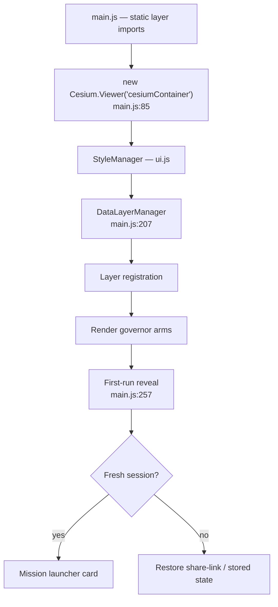
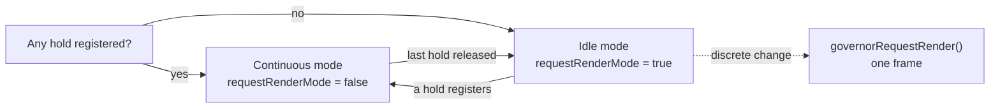

# Bootstrap and Rendering

How the app comes up, and how it avoids burning a GPU while doing nothing.

---

## Startup order

`src/main.js` is the entry point. It imports every layer module statically, then
sequences construction.

**Nothing fetches before a mission tile is clicked.** The first-run launcher
(`src/firstRunExperience.js`, `#first-run-launcher`) offers **Live Contacts ·
Space Missions · Environmental · Explore manually**, and no layer and no optional
API call happens until a tile is chosen.

Two deliberate details in that card, per `CURRENT-STATE.md`:

- **ENVIRONMENTAL is quakes *and* fires** — `['earthquakes', 'local-firms']`.
- **It does not trim itself to the lowest-configured install.** The mission never
  branches on whether a key is present; everyone is offered the same tile. Keyless,
  the honest surface is the layer row reading `UNAVAILABLE · NASA FIRMS · LIVE ·
  KEY REQUIRED`, while the earthquakes half still delivers in full.

That is a general principle in this app: **degrade in the status surface, not in
the offer.**

---

## The render governor

`src/renderGovernor.js`. The most consequential performance mechanism in the app,
and the one most likely to be broken by an innocent-looking change.

**The problem it solves:** Cesium's default loop repaints every vsync forever. With
zero layers enabled and a parked camera, the app burned ~60% GPU and ~54% of a core.

**The design:** a binary mode driven by ref-counted holds.

| Mode | Condition | Behaviour |
|---|---|---|
| **Continuous** | ≥1 hold | Byte-identical to pre-governor behaviour. Interpolation and tracking invariants preserved by construction |
| **Idle** | 0 holds | Cesium auto-renders on camera input and tile loads. Every other scene mutation must request its own frame |

### The rule when you touch the scene

Every per-frame animator registers a hold **for exactly the lifetime of its
scene-loop listener or animation**: fleet interpolation, traffic simulation,
satellite motion, tracked-entity follow, style crossfades, CCTV projection.

Everything else — a discrete mutation while idle — must call
`governorRequestRender()` or **it will not appear until something else triggers a
frame.** This is the classic governor bug: the state changed, the screen didn't.

### Worked example: earthquakes hold nothing

`CURRENT-STATE.md` documents this as an operational note, and it is the clearest
illustration of the model.

Every quake is a `CLAMP_TO_GROUND` ellipse. A `CallbackProperty` axis re-tessellates
its ground primitive **every frame** — measured at 32.4 ms/frame and 30 fps on the
shipped 58-event feed. The fix was to make the axes plain numbers, redefined only
when a poll brings new data, and to delete the ±15% radius pulse.

The result: nothing in the layer animates per frame, so it holds **no** continuous
render. The governor stays idle with earthquakes on, and the manager's `layer-tick`
/ `layer-visibility` requests carry new data to the screen. Pinned by
`src/data/earthquakes.test.mjs`.

**Read that as a template.** A `CallbackProperty` is a per-frame cost even when its
value never changes.

---

## Camera gating

Most layers only fetch below an altitude threshold — traffic at ~8 km, for
instance. An idle globe view issues almost no requests. When adding a layer, gate
it; an ungated viewport-driven fetch is a quota leak.

---

## Where to look

| Concern | File |
|---|---|
| Entry, viewer construction, registration | `src/main.js` |
| Render mode holds | `src/renderGovernor.js` |
| First-run card | `src/firstRunExperience.js` |
| UI shell, styles, control facade | `src/ui.js` (10,310 lines — the largest module) |
| Layer orchestration | `src/data/manager.js` |

Cold-start budgets are in [`docs/PERFORMANCE.md`](../docs/PERFORMANCE.md); the
median was 1.86 s in a point-in-time M5/Chrome capture — a comparison baseline, not
a hardware requirement.
