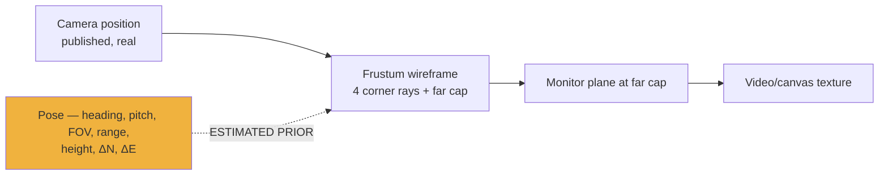

# CCTV

~800 public cameras projected *into* the 3D scene, with estimated poses you
calibrate by hand. `src/data/cctv.js` is 4,825 lines — the third-largest module.

| Concern | Module |
|---|---|
| Layer, catalog, frames | `data/cctv.js` |
| Detail cards | `data/cctvCards.js` |
| Calibration gizmo | `data/cctvGizmo.js` |
| Viewshed volumes | `data/cctvViewshed.js` |
| Level of detail | `data/cctvLod.js` |
| Focus policy | `cctvFocusPolicy.js`, `cctvFocusRequest.js` |

---

## Sources

Keyless by default, with a Street View fallback.

| Pack | Cap | Notes |
|---|---|---|
| **Austin** | 250 (`CCTV_AUSTIN_MAX_SOURCES`, hard bound 300) | Filtered to `camera_status === TURNED_ON` — ~815 live of 1,003 rows |
| **Caltrans** (CA) | 300 | Districts 4/7/11/3 — SF, LA, San Diego, Sacramento |
| **TfL London** JamCams | 250 | Attribution **contractually required** |

`CCTV_CALTRANS_DISTRICTS` is a deliberate exception to the launcher's
empty-means-unset rule: **empty is its documented kill switch** and is passed through
as-is.

Frames are stills-first, refreshed every 10 s while active.

---

## The projection model (v2 foundation)

Not a webcam embed — a pitched **frustum wireframe** (4 corner rays + a far-cap
rectangle) with a **monitor plane at the far cap**, reusing the video/canvas texture
pipeline.

**Manual calibration only.** Auto-calibration and the drape-mesh pipeline were
deleted. A one-shot activation obstruction probe (`pickFromRay` on activation,
clamping the plane short of the first hit) remains.

Three findings fixed in the 2026-07-04 field validation, worth knowing as
regressions to watch:

1. The ground clamp lifts the cap **centre only**, so the wireframe stays a true
   pyramid welded to the plane — it was a flattened fan, ~47.5 m divergence.
2. Re-selecting the active camera is a **no-op** — killed a click-flash.
3. Texture swaps **gate on canvas content** — killed a periodic white flash.

---

## Coverage: a tri-state cycle

`OFF → ON → VIEWSHED`

**VIEWSHED** renders each visible camera's frustum as a translucent **colour-coded
volume** (golden-angle hue per camera, `cctvViewshed.js`) welded to the same five
points as the wireframe — **zero new scene queries or update cadences.** That reuse
is the reason the mode is affordable.

Coverage polylines are created **lazily** rather than inserting five entities per
catalog camera at init: default `COVERAGE ON` creates the active/visible 14-camera
cohort, and activation always creates the selected frustum even with `COVERAGE OFF`.

---

## Calibration gizmo (v3)

The seven sliders were **deleted**. `ADJUST` mode puts a direct-manipulation gizmo on
the active camera (`cctvGizmo.js`):

| Handle | Degrees of freedom |
|---|---|
| Heading / pitch rings | 2 |
| E / N / U arrows | 3 |
| Range handle (cap centre) | 1 |
| FOV handles (cap edges) | 1 |

All seven offset DOF, plus a click-to-edit **effective-pose readout** — HDG, PITCH,
FOV, RANGE, HGT, ΔN, ΔE — in absolute values.

Persistence: `godsEyeView.cctv.calibration.v2`. **The store was wiped clean; there is
no import from the old `v1` key.**

A panel-only `CAL` badge shows `CALIBRATED` / `CURATED` / `RAW PRIOR` — with **no
in-world tint**, so calibration state never masquerades as image quality. The panel
is titled "CCTV", not "CCTV MESH".

### The v3 floor QA pins

These are the assertions that keep the shared-floor logic honest:

- **Zero** samples for heading-only edits
- **Zero** transient samples and constant elevation during E/N drag
- **One** shared-floor resolution on release
- Late one-shot shared-cell work is permitted during viewshed idle

The A+B harness intentionally excludes citywide LOD assertions.

---

## Loading cadence

Staggered geometry/frame loading is **active-first**:

| Condition | Rate |
|---|---|
| Normal | 4 records per 120 ms |
| While tracking or cockpit owns the view | 2 per 250 ms |

Re-evaluated each batch. Progress notifications coalesce at roughly 300 ms or ten
batches; natural completion and disable each publish their terminal state through
their own completion paths. A `LOADING FRAMES` chip and the preview-first
auto-expanding panel are unchanged.

---

## Fidelity

**Positions are published and real. Poses are estimated priors.** The viewshed shows
where a camera is *estimated* to reach and where it goes blind — an estimate rendered
as a volume, which is why the `RAW PRIOR` badge matters.

The `NEAREST` control hands off from a tracked fire or vessel to the nearest live
camera — a real workflow, built on estimated geometry.

---

## Security

The CCTV proxy **rejects client-specified upstream URLs** — server-side source
allowlist only. Upstream still-image fetches use an explicit abort controller with an
**eight-second timeout**, cleared on every success and failure path. The health map
is bounded.

---

## Known issue

`CURRENT-STATE.md` and [`docs/KNOWN-ISSUES.md`](../docs/KNOWN-ISSUES.md) both note
that the CCTV panel can appear "missing" after layout refactors. Check the right-rail
lane ownership rules in [visual-styles-and-hud.md](visual-styles-and-hud.md) before
assuming the layer failed — **CCTV and Context are mutually exclusive** in the rail.
