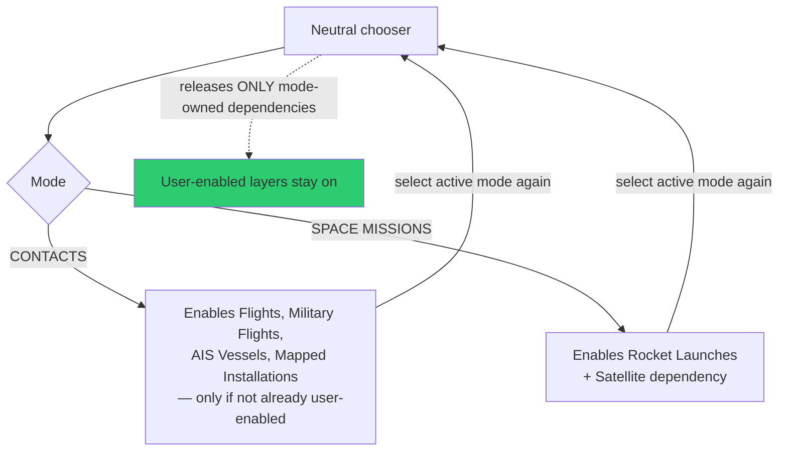

# Context, Contacts, and Cockpit

The "situational picture" surface: a coordinator that stages whole sets of layers,
a contact roster, and a camera that rides inside a live aircraft.

---

## The Context coordinator

`src/data/militaryAwareness.js` (1,907 lines) is registered internally as the
Contacts coordinator but is **not** a user-visible Data Layers entry. Its entry
point is the right-side `CONTEXT` chooser.

Available in every visual style. The chooser exposes a neutral shell and **does not
enable a live-data dependency until a mode is selected.**

The two modes are **mutually exclusive**. Satellites are deliberately excluded from
the Contacts cohorts and keep their own tracking UX.

### Reversible ownership — the core rule

**Disabling Context releases only the dependencies Context enabled.** Layers the
user turned on themselves stay on. This is what makes the mode safe to toggle.

It also removes the Military-layer suppression handoff when Context owned Military,
letting an already-enabled civilian Flights layer resume normal mixed rendering.

### Adoption of an existing track

If a civilian or military aircraft is **already tracked** when `CONTACTS` becomes
operational, that source-owned track is adopted as the Context subject *before*
nearest-contact autofocus.

- Context rechecks the tracker after dependencies settle, so a newer selection wins.
- An explicit clear during activation prevents fallback silently selecting a
  replacement.
- **Cockpit entry is unavailable until that transaction settles**, so its camera
  takeover cannot clear Cesium tracking before adoption.
- Adoption does **not** recreate tracking or transfer camera ownership. It
  initializes the 250 km ring, history, proximity results, and Cockpit
  Previous/Next state for the original aircraft.

### Space Missions is replay-isolated

Rocket Launches and Satellites are the **only** Data Layers permitted while the mode
is active.

| Guarantee | Behaviour |
|---|---|
| Entry | Waits for incompatible layers to shut down; direct incompatible enables are blocked *before* lifecycle work |
| Snapshot | Direct UI and voice entry capture the same pre-entry snapshot |
| Internal enables | Dependency and restoration enables do **not** create a user-owned Context session |
| Newer ON | Takes ownership of the pending entry without releasing its isolation snapshot |
| Abort / OFF / teardown | Waits for exact manager settlement, restores the snapshot, does **not** resurrect Rocket Launches |
| Partial restore + late abort | Completes the same exact target without the stale caller signal, then replays newer explicit layer intent |
| Rejected teardown | Retains the truthful enabled state, rolls stopped siblings back to the captured set, aborts replay |

Contacts, by contrast, is **additive** and restores user-enabled layers normally.

---

## Search Nearby Sites

`SEARCH NEARBY SITES` retains bounded OSM results and makes **one** user-initiated,
view-biased Google Places text search for "military installation".

Google results are source-stamped and deduplicated against OSM by rounded
location/name, and remain **mapped context rather than operational claims.** If
Places is unavailable, or the API is not enabled for the supplied key, OSM context
remains available.

The key stays server-side via `/api/google/text-search`.

---

## Cockpit

Ride inside a tracked contact with real terrain holding underneath, all the way
down. Sensor styles come along.

| Module | Role |
|---|---|
| `cockpitTracking.js` | Follow-camera ownership |
| `cockpitMath.js` | Geometry |
| `cockpitAirLod.js` (`data/`) | Level of detail in air |
| `cockpitCloudEffects.js` | Opt-in **WX** volumetric clouds from real observations |
| `cockpitVisionPolicy.js` | What the vision model may look at |
| `cockpitUtilityLayout.js` | Panel layout |
| `cockpitContactDot.js` (`data/`) | Contact rendering |

**Contacts** keeps a 250 km roster one click away — step plane to plane and fall
straight into the next cockpit.

### The briefing strip

Nearby live signals, regional headlines, and real local weather, via
`/api/regional-brief`. That proxy rounds aircraft coordinates into **0.1° cache
cells**, caches for five minutes, and serializes Nominatim calls at no more than
**one request per second** — Nominatim's usage policy is a hard constraint, not a
courtesy.

Google News RSS is queried with the resolved locality first; **GDELT is used only
when that RSS query fails or is empty.** Google's terms restrict that source to
personal, noncommercial use, so a commercial deployment must disable or replace it.

Honesty note carried in the UI: headlines are **location-query matches, not verified
incidents, risk rankings, or evidence that a location is safe.** Empty, partial,
stale, and unavailable source states remain distinct — they are not collapsed into
one "no data".

`WX OFF` disables cockpit weather *rendering* only; the Local Info briefing still
fetches its source-backed weather values and shows the required Open-Meteo credit.

### Stale contacts freeze

Under source backoff the cockpit is marked `STALE` and **holds the exact layer
position instead of continuing inertial flight** — see
[motion-and-symbology.md](motion-and-symbology.md). A stale aircraft must not keep
flying convincingly.
