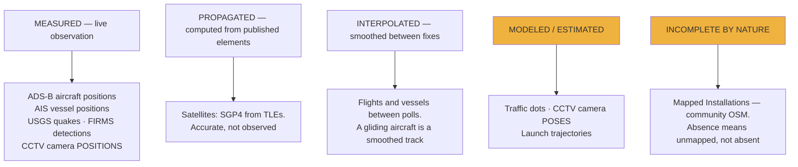
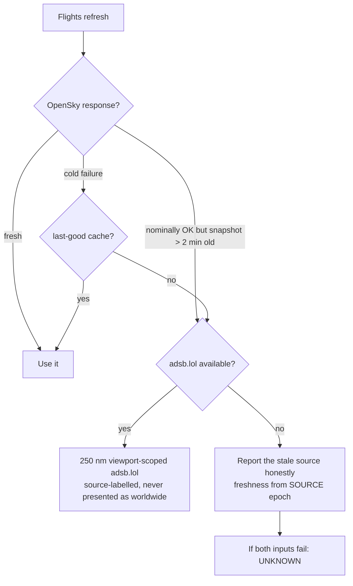

# Data Layers Reference

Every layer in runtime: source, module, proxy, cadence. Transcribed from
[`docs/CURRENT-STATE.md`](../docs/CURRENT-STATE.md) §Active Data Layers — that table
is authoritative; this adds fidelity notes.

---

## The registry

| Layer | Source | Module | Proxy | Interval |
|---|---|---|---|---|
| **Live Flights** ✈️ | OpenSky; bounded adsb.lol regional fallback | `data/flights.js` | `/api/opensky` | 30 s |
| **Military Flights** 🎖️ | adsb.lol `/v2/mil` | `data/militaryFlights.js` | `/api/adsblol/mil` | 15 s |
| **Live AIS Vessels** 🚢 | AISStream websocket | `data/aisLiveVessels.js` | `/api/ais-live` | 60 s (+800 ms visibility pass) |
| **Mapped Installations** ⌖ | OSM; on-demand Google Places supplement | `data/militaryInstallations.js` | `/api/military-installations`, `/api/google/text-search` | viewport + search; 30 s → 240 s backoff while unavailable |
| **Earthquakes** | USGS | `data/earthquakes.js` | — | 60 s |
| **Satellites** | CelesTrak | `data/satellites.js` | `/api/celestrak` | 120 s |
| **Space Missions (30 d)** | Launch Library 2 + CelesTrak | `data/rocketLaunches.js` | `/api/launches`, `/api/celestrak/active` | 5 min |
| **Traffic** | OSM Overpass + optional TomTom | `data/traffic.js` | `/api/overpass`, `/api/tomtom` | viewport-driven |
| **CCTV** | Austin + Caltrans + TfL; Street View fallback | `data/cctv.js` | `/api/cctv` | 10 s (active) |
| **Radio** | Radio Browser | `data/radio.js` | `/api/radio/*` | 45 min directory refresh |
| **Bikeshare** 🚲 | GBFS (Lyft + BCycle) | `data/bikeshare.js` | `/api/gbfs` | 60 s |
| **FIRMS Active Fires** ▲ | NASA FIRMS (VIIRS ×3 NRT, trailing 24 h) | `data/firmsHeatmap.js` | `/api/firms` | 10 min (proxy TTL 30 min) |
| **Datacenters** ▣ | OSM extract, bundled | `data/localLayers.js` | — | static |
| **Dams** ▰ | OpenInfraMap/OSM extract, bundled | `data/localLayers.js` | — | static |
| **Submarine Cables** ◠ | TeleGeography, bundled | `data/telegeographySubmarineCables.js` | — | static |

`src/data/militaryAwareness.js` is registered internally as the **Contacts
coordinator** but is *not* a user-visible Data Layers entry. Its entry point is the
right-side `CONTEXT` chooser's `CONTACTS` mode — see
[context-contacts-cockpit.md](context-contacts-cockpit.md).

---

## Fidelity — measured, propagated, modeled

The single most important distinction in the application. It has the visual grammar
of a classified feed; only some of it is observation.



| Layer | What is real | What is not |
|---|---|---|
| Traffic | Street geometry (OSM); segment colours in live mode | **Every dot.** Positions, count, and `VEH-####` IDs are synthetic — the ID is an array index. See below |
| CCTV | Camera positions (published) | Poses are estimated priors; you calibrate by dragging a gizmo |
| Space Missions | Launch metadata, timing | Trajectory — labelled `RECONSTRUCTED ESTIMATE`, scrubbable 0.25×–4× |
| Mapped Installations | Present entries | Completeness. Labelled as incomplete deliberately |

### The traffic dots are not vehicles

Worth stating explicitly because the UI implies otherwise. TomTom returns a vector
tile of road segments, each carrying one number — `traffic_level`, current speed ÷
free-flow speed ([`trafficFlowStyle.js:6`](../src/data/trafficFlowStyle.js)) — with
buckets at ≥ 0.85 free, ≥ 0.55 slow, below that jam. Non-finite input degrades to
free-flow so unusable data never renders as a phantom jam.

The dots are `PointPrimitive`s the app spawns along Overpass polylines. Their count
is a rendering budget allocated across visible roads. With the detection overlay on
they get `VEH-####` labels, which look exactly like tracked contact IDs:

```js
id: `VEH-${String(i).padStart(4, '0')}`,   // traffic.js:2413
```

`i` is the loop index into the local `_dots` array, which is emptied and rebuilt on
viewport change (`traffic.js:2155`, `traffic.js:2195`). Pan away and back and
`VEH-0266` is a different dot on a different street. A real tracking identity — an
ADS-B hex — survives a refetch. These do not.

The data is honest; the label styling borrows the aircraft layer's grammar, where
IDs *are* transponder identities. Don't propagate that when extending.

**Traffic needs both feeds.** Flow without geometry loads forever. When traffic
won't load, check `/api/overpass` before suspecting TomTom.

---

## Flights: source selection

More nuanced than "OpenSky with a fallback".



The fallback is capped at 250 nm around the camera subpoint, always visibly
source-labelled, and **military-feed rows are never relabelled as civilian data.**

---

## Radio

Radio has by far the strictest contract in the app — atomic catalog admission,
generation tokens, tuner drag semantics, playback ownership epochs. It has its own
document: [radio.md](radio.md).

---

## Licensing

Several sources restrict use. `OpenSky` is non-commercial research/education and
live-product use can require a written agreement; bundled TeleGeography cables are
CC BY-NC-SA and **not** covered by the repo's MIT licence; Google News RSS (cockpit
briefings) is personal/noncommercial. Full detail in
[`DATA_SOURCES.md`](../DATA_SOURCES.md), which opens with the operative rule: *if
your use doesn't fit a dataset's license, remove that dataset.*
