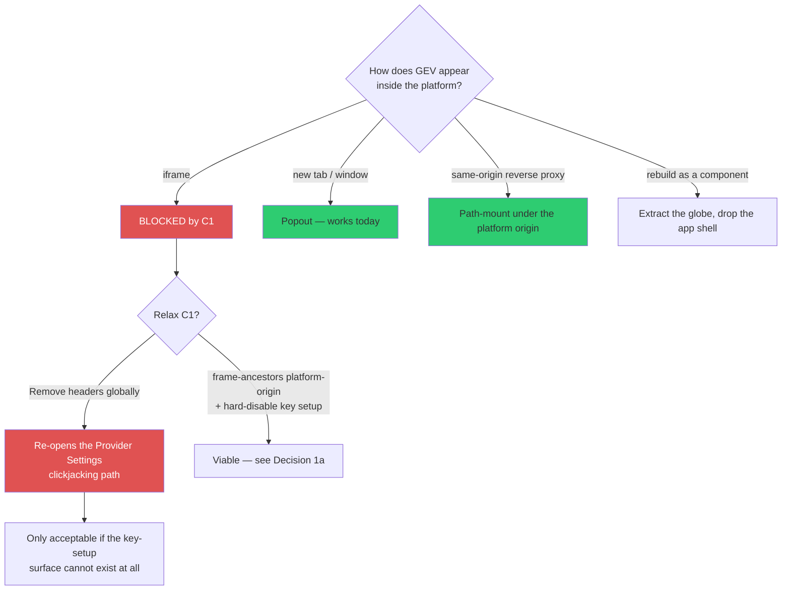
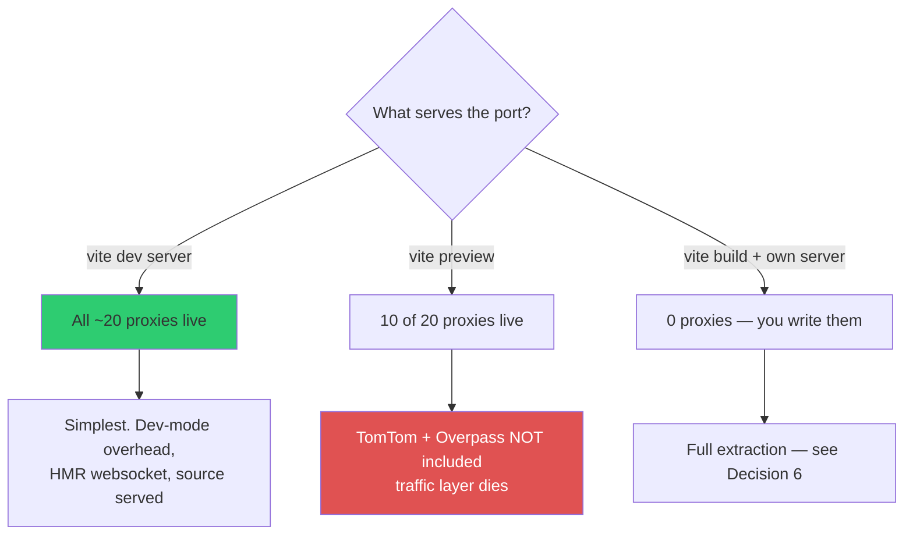
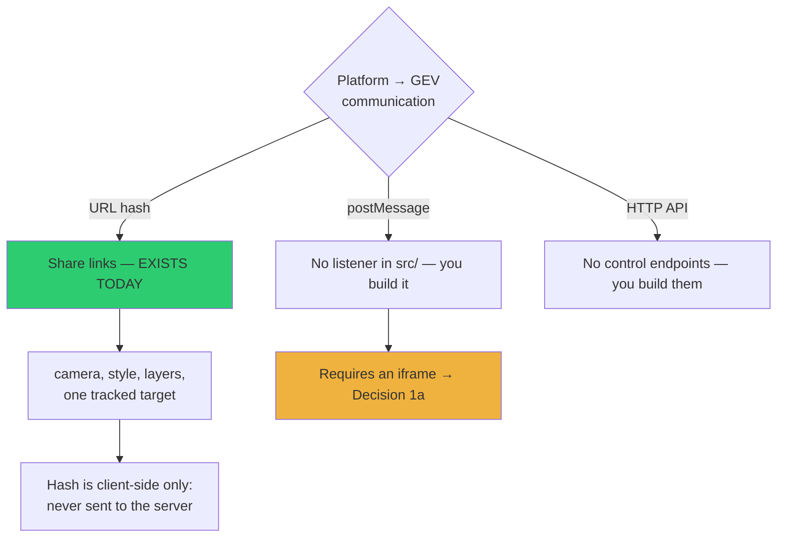
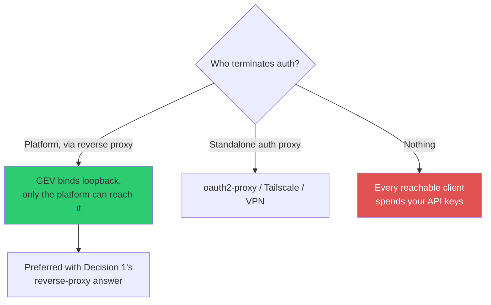
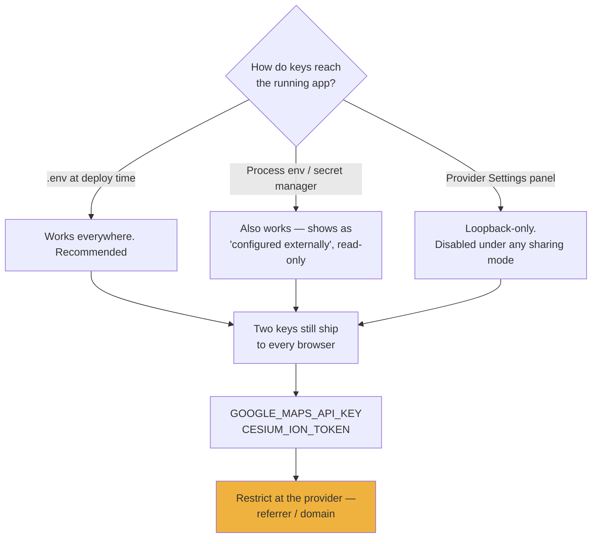
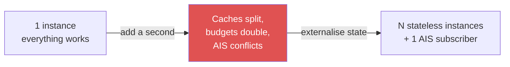
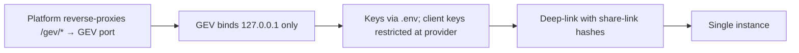

# Deploying GEV as a service on a separate port

**Goal:** run this app on its own port and integrate it into a host platform.

This is an engineering decision record, not a plan. Every constraint below was
verified against the tree; line references are to the current `vite.config.js`.

---

## The three constraints that drive everything

Read these first — most integration designs die on one of them.

| # | Constraint | Where | Effect |
|---|---|---|---|
| **C1** | `X-Frame-Options: DENY` + `frame-ancestors 'none'` on **every response the server serves** | [vite.config.js:7725](../vite.config.js) | **You cannot iframe it.** Not a default — a deliberate control with a documented attack model |
| **C2** | No `Access-Control-Allow-*` headers anywhere | verified: zero matches | A separate port is a separate origin, so the platform's JS **cannot fetch `/api/*`** |
| **C3** | `allowedHosts: ['localhost','127.0.0.1','.local']` unless `HOST` is `0.0.0.0`/`::` | [vite.config.js:7711](../vite.config.js) | Reaching it by any other hostname returns a host-check failure |

C1's rationale, verbatim from the source, is worth understanding before you touch it:

> Framing protection belongs on the APP DOCUMENT, not on API responses […] Without
> this, a hostile page could frame `/?setup=1`, align a lure over Provider Settings,
> and have the framed app issue a perfectly same-origin credential write that passes
> every Host/Origin check.

The header is what makes that attack *impossible* rather than *unlikely*. Any
decision to relax it has to replace that guarantee, not just remove it.

---

## Decision 1 — embedding model

The first and most consequential fork.



| Option | Effort | Keeps C1's guarantee | Notes |
|---|---|---|---|
| **Popout** (new tab/window) | none | ✅ | Works today. Platform drives it by URL — see Decision 3 |
| **Same-origin reverse proxy** | low | ✅ | Platform serves `/gev/*` → GEV's port. No longer cross-origin, so C2 dissolves too |
| **iframe, narrowed CSP** | medium | ⚠️ conditional | Requires killing key setup — Decision 1a |
| **iframe, headers removed** | low | ❌ | Do not |
| **Extract the globe as a component** | high | n/a | Different project; you inherit Cesium wiring, not the app |

**Recommendation: same-origin reverse proxy.** It removes two of the three
constraints at once and costs one proxy block. You keep the framing guarantee
because the platform's own document policy governs, and `/api/*` becomes
same-origin so no CORS work is needed.

### Decision 1a — if you must iframe

Then all three must hold:

1. Replace the blanket headers with `frame-ancestors <platform-origin>` — an
   allowlist, never `*`.
2. **Guarantee the key-setup surface cannot exist.** It is already `apply: 'serve'`
   ([vite.config.js:7423](../vite.config.js)) and loopback-only, and it disables
   itself under any sharing mode. Do not rely on all three incidentally — assert it.
3. Keep `X-Frame-Options` off only where CSP is honoured; the two disagree on
   allowlists, and stale proxies may honour the older header.

---

## Decision 2 — process model

What actually runs on that port.



Verified: 21 `configureServer` registrations vs 10 `configurePreviewServer`. The ten
that survive `preview` are `radio-browser`, `rocket-launches`, `ais-live`,
`track-backfill`, `openai-realtime`, `google-places-context`,
`military-installations`, `regional-brief`, `weather-effects`, `gev-key-setup`.

**`vite preview` is the trap.** It looks like "the production mode" and boots
cleanly, but the traffic layer's two feeds are both missing. A built artifact is not
a smaller version of the dev server; it is a different, partial one.

**Recommendation for a first integration: run the dev server.** It is the only mode
where the whole app works. Treat extraction (Decision 6) as a later phase, driven by
a concrete need — not by discomfort at the word "dev".

---

## Decision 3 — the control channel

How the platform tells GEV what to show.



`src/sharelink.js` encodes camera position, visual style, active layers, and a
tracked target into the **URL hash**, and parses it on load. That is a real,
maintained integration surface and it exists now.

Two properties that matter:

- **The hash never reaches the server.** Deep-linking costs no request and leaks
  nothing to logs or proxies.
- **A tracked target in a link is a handoff, not a bookmark** — it resolves against
  live data at open time.

`grep -rn postMessage src/` returns **nothing**. There is no host-page control API
and no listener to talk to. If you need the platform to steer a *running* instance
rather than launch a configured one, that is new code — and it needs an iframe, so
it collapses back into Decision 1a.

| Need | Use |
|---|---|
| Open GEV at a place/state | URL hash — today, no code |
| Platform reads GEV's current view | Not available — build it |
| Live bidirectional control | postMessage + iframe — build both |

---

## Decision 4 — identity and auth

The app has **no concept of a user**. Nothing to integrate with; the question is
only who stands in front.



**Bind GEV to loopback and let the platform be the only client.** If the platform
already authenticates users, this inherits it for free and the app never becomes
directly reachable.

If GEV must bind a routable interface, note what changes: `HOST=0.0.0.0` sets
`allowedHosts: true` (C3 dissolves) **and** Provider Settings disables itself. That
is deliberate — the panel refuses to trust socket identity, because tunnelled
traffic also arrives from loopback.

---

## Decision 5 — key custody



Provide keys through `.env` or the process environment; do not plan on the panel
surviving a shared deployment. Externally-supplied keys are read-only to the panel
and return `409` — a deliberate guard covering replace as well as remove.

The two client-exposed keys are injected at config time
([vite.config.js:7732](../vite.config.js)) and are readable by anyone who loads the
page. **Restricting them at the provider is the only control that exists.** This is
architectural — the SDKs require them client-side.

---

## Decision 6 — extraction, if and when

Only relevant once you outgrow a single instance. The handler logic is portable:
parsing and policy already live in Cesium-free, Node-free modules that
`vite.config.js` imports from `src/` (13 of them), and
[browserModuleBoundary.test.mjs](../src/browserModuleBoundary.test.mjs) fails the
build if a browser module imports `node:*`. Re-mounting is mechanical.

The state assumptions are not.

| State | Where | Breaks how | Fix |
|---|---|---|---|
| Disk caches | `.gev-cache/{overpass,tomtom,military-installations}` | Per-instance; hit rates collapse behind a balancer | Shared store |
| In-memory LRUs | 27 `new Map()` | Same | Shared store |
| Budget governors | Daily counter on disk | **N instances → N × budget.** A 40,000-tile cap becomes 40,000 *each* | Atomic shared counter |
| AIS WebSocket | `aisStreamAdapter.js` | One socket, monotonic generations never reused *including across `dispose()`* | Redesign: one subscriber, fan-out |

**AIS is the hard one** — a single-process design by construction, not by accident.



Stay at one instance for as long as you can. The step from 1 to 2 is where the
real work is; 2 to N is comparatively cheap.

---

## Recommended path



Why this shape:

- Same-origin, so **C1 and C2 both dissolve** without weakening either control.
- The platform's existing auth becomes GEV's auth. No user model needed.
- Uses the control channel that already exists rather than building one.
- One instance sidesteps every item in Decision 6.

Concrete config to verify before you rely on it: whether Vite needs `base` set when
mounted under a path prefix (no `base` is configured today — the app assumes `/`),
and how the HMR websocket behaves through your proxy. **Both are unverified here.**

---

## Verification checklist

Run against the integrated deployment, not the local one:

```bash
# framing headers present (or deliberately narrowed)
curl -sI http://<gev>/ | grep -i "x-frame-options\|content-security-policy"

# key-setup surface must NOT be reachable from the platform
curl -s -o /dev/null -w "%{http_code}\n" http://<gev>/api/setup/status   # expect non-200

# the two feeds the traffic layer needs
curl -s http://<gev>/api/tomtom/status
curl -s -o /dev/null -w "%{http_code}\n" -X POST http://<gev>/api/overpass \
  -H "Content-Type: application/x-www-form-urlencoded" \
  --data-urlencode "data=[out:json][timeout:25];out count;"

# client bundle: confirm only the two intended keys are present
grep -o "AIza[A-Za-z0-9_-]*" dist/assets/*.js | head
```

The last one matters most. Any key other than Google Maps and Cesium ion appearing
in the bundle is a defect, not a configuration choice.

---

## Open questions

Not investigated — answer before committing to a design.

- Does Vite need `base` set when path-mounted, and does the Cesium asset loader
  respect it?
- HMR websocket behaviour through the platform's proxy — and whether to disable HMR
  outright for an integrated deployment.
- Whether upstream rate limits are per-key or per-IP, which decides if multiple
  instances behind one NAT compete for a single allowance.
- Whether any layer's licence conflicts with the platform's use — `OpenSky` is
  non-commercial and the bundled TeleGeography cables are CC BY-NC-SA. See
  [DATA_SOURCES.md](../DATA_SOURCES.md); it is short and worth reading in full
  before launch rather than after.
