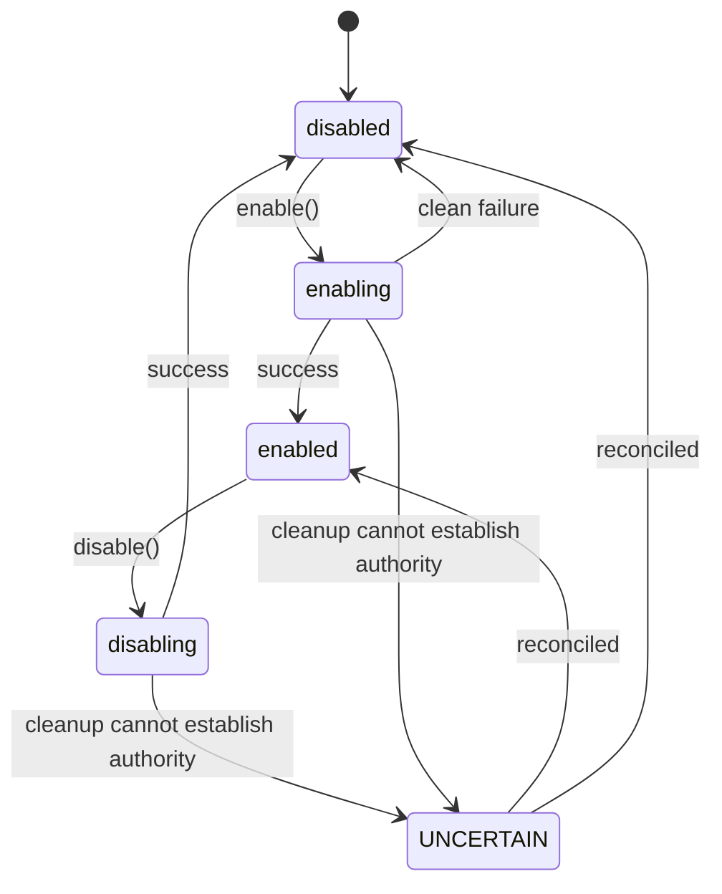

# Layer System

`src/data/manager.js` (`DataLayerManager`, 2,288 lines) owns every layer's
lifecycle. This is the app's transaction engine, and its contract is stricter than
most layer registries.

---

## Lifecycle vocabulary

Four public states plus **a separate uncertainty bit**:

`enabling` · `enabled` · `disabling` · `disabled`, plus `lifecycleUncertain`.

**The uncertainty bit is the interesting part.** When teardown fails in a way that
leaves the module's real state unknown, the manager does not guess. It:

- retains the **last authoritative** visibility boolean,
- exposes `UNCERTAIN` in the layer row, the player message, the compact status, and
  the accessible label,
- keeps Enable/Disable available so a user can reconcile it,
- and makes the *next* same-target request perform **real lifecycle work** instead
  of taking the stable-state no-op — clearing the reconciliation debt only after a
  confirmed enable or disable.

A resolved `false` from init, enable, first update, or disable is a **lifecycle
failure**, not a soft outcome. Rejected promises and resolved-`false` are both
transaction failures.

---

## Transactions, epochs, and ownership

Concurrency here is real, because voice, UI, share-link restore, and the Context
coordinator can all drive the same layer.

| Mechanism | Purpose |
|---|---|
| **Intent epoch** (per layer) | Every absolute visibility request advances it and aborts the older transaction — *including a same-target request whose newer origin must own persistence* |
| **Obsolete request suppression** | A superseded queued request never starts. Obsolete in-flight cleanup keeps presentation transitional and hidden |
| **Post-callback recheck** | The epoch is rechecked *after* synchronous lifecycle-presentation callbacks, so a re-entrant newer request stops the older transaction arming a timer or publishing a settled event |
| **Snapshot + compensating rollback** | Context entry captures the prior layer snapshot and restores it exactly on failure |
| **One operation, one notification** | A wrapped operation owns exactly one failure-or-blocked notification; its synchronous manager event is suppressed only for that operation |

**Only the latest request may adopt or reconcile transitional state and publish
settled visibility.** That single rule explains most of the defensive code.

---

## Presentation gate

Layer sources, shared overlays, selected markers, and pick handlers sit behind a
**manager-owned presentation gate**. They stay hidden and inert throughout
`enabling`, `disabling`, cancellation, failure, and uncertain reconciliation — and
activate only for certain `enabled`.

This is why you cannot make a layer "appear early" by drawing before the manager
settles. It is deliberate: a half-enabled layer that accepts picks is a source of
false readings.

---

## Feed health

Enabled layer controls report normalized health **on the button**, with the source
and reason retained in the metadata line.

| State | Meaning |
|---|---|
| `LOADING` | In flight |
| `DEGRADED` | Usable but partial — e.g. a partial CelesTrak group failure keeps the usable catalog |
| `STALE` | Last-good data, past freshness |
| `FALLBACK` | Serving an alternate source, labelled as such |
| `UNAVAILABLE` | No usable data — e.g. a total CelesTrak outage keeps last-good visible but reports `UNAVAILABLE` |

Two honesty rules worth preserving:

- **A missing optional key is a configured terminal state**, not a failed mission.
  The shared loading reducer treats an explicitly declared missing key that way, so
  the global chip completes rather than showing `LOAD FAILED`. A genuine lifecycle
  or fetch failure still retains failure.
- **Freshness uses the source epoch, never the cache receipt time.** When OpenSky's
  own snapshot epoch is stale and no fallback is available, the UI reports an old
  snapshot rather than "just now."

---

## Bundled datasets

`src/data/local_data/` holds five packs with per-folder provenance READMEs, lazily
loaded through `src/data/localGeojson.js` as Vite `?url` assets when toggled on.

**A bundled dataset that fails to load is a broken install, not a blip.** So:

- `localGeojson.js` guards `response.ok` and reports `error` + `lastUpdate` through
  `getStats()` — an `UNAVAILABLE` chip, never a green `ON` over an empty globe.
- It commits its Cesium data source **only after setup completes**, so a partial
  failure retries on the next enable.
- The two non-layer packs (`naturalEarthRegions.js`, `neighborhoodPolygons.js`)
  have no stats contract, so they instead **refuse to memoize a failure**:
  `src/data/retryableLoad.js` caches success permanently and retries a failed load
  after a doubling cooldown (5 s → 5 min). One bad load must not silently demote
  every later lookup for the session.

---

## Adding a layer — checklist

1. Module in `src/data/`, registered in `src/main.js`.
2. Camera-gate the fetch.
3. Proxy in `vite.config.js` if it needs a key or has abusable quota — see
   [server-proxies.md](server-proxies.md).
4. Report honest feed health; never green-over-empty.
5. Register attribution via `dataCredits.js` if the source requires it.
6. Split pure logic into a Cesium-free sibling with a `.test.mjs`.
7. Register a render-governor hold **only** if it animates per frame — see
   [bootstrap-and-rendering.md](bootstrap-and-rendering.md).
