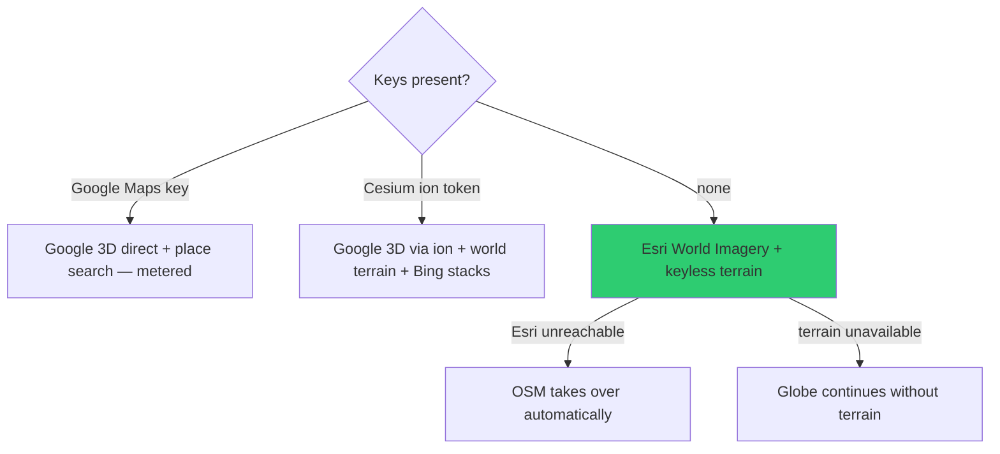
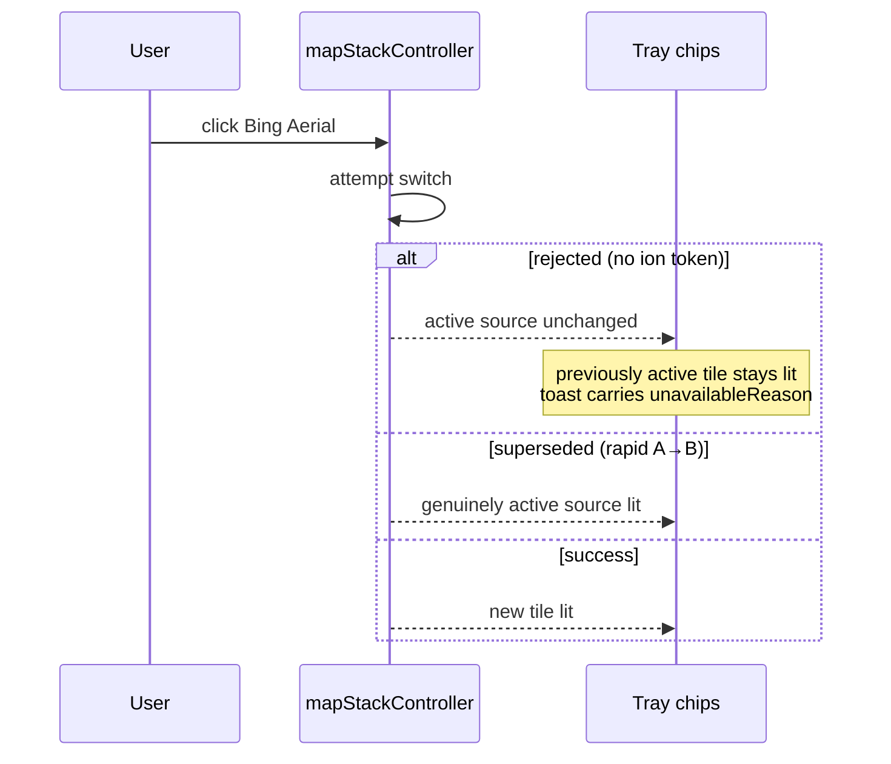

# Map Stack

`src/mapStackController.js` — which planet you are looking at, and how switching
stays honest when a source is unavailable.

---

## The five sources

| Stack | Requires | Notes |
|---|---|---|
| **Google 3D** (`photoreal`) | Google key **or** ion token | The cinematic default when either key is present |
| **Esri Satellite** | nothing | **The zero-key default landing**, with keyless terrain |
| **Bing Aerial** | `CESIUM_ION_TOKEN` | via Cesium ion world imagery |
| **Bing Aerial with Labels** | `CESIUM_ION_TOKEN` | as above |
| **OSM** | nothing | Tile fallback; the one shipped road basemap |

**Bing Road is retired** — gone from `MAP_STACKS`, from the `set_map_stack` enum,
and from the voice aliases. Road phrasings now resolve to OSM. An old
`map=bing-road` share link is simply an unknown id and takes `setStack()`'s
existing photoreal fallback.

---

## Availability ladder



Every path lands on a working globe. That is the design intent: no key is a
prerequisite for anything.

---

## The switching contract

The subtle part, and the reason this has its own QA harness.

**The lit tile follows controller state, not the click.**



| Case | Behaviour |
|---|---|
| Rejected (no ion token) | The genuinely active source stays lit |
| Superseded (rapid A→B) | The genuinely active source stays lit |
| In flight | Tray heading shows `...` |
| `lastError` | Tray heading goes amber |

Ion stacks stay **visible and keyboard-focusable** without a token, but expose
`aria-disabled="true"` and do not switch. Their accessible label and tooltip quote
`getStacks().unavailableReason` — the *same string* `setStack()` puts in the toast.

The `ION` badge is gated on the stack's own `requiresIon`, so a `photoreal` chip
that is unavailable because the **Google tileset failed** says so, rather than
falsely demanding an ion token. That distinction matters: it stops users buying a
token to fix a problem a token would not fix.

---

## Where it lives in the UI

Map Source is a **five-tile row in the bottom Visual Presets tray**
(`#map-stack-chips`, `src/mapStackChips.js`). The duplicate left `#stack-panel` is
retired, and the `k` panel token that addressed it is gone from the share registry —
legacy `ui=k...` state takes the ordinary unknown-token skip.

Tiles share one row on desktop, two on narrow screens, carry `aria-pressed` on the
active source, and stay keyboard-reachable with a visible focus outline.

---

## One path in, three callers

Share-link restore, the `set_map_stack` voice tool, and the chip row all land on the
same `_setMapStack()` path. Stack choice participates in share links
(`src/sharelink.js`) and falls back to the best available stack when the requested
one is unavailable.

**Do not add a fourth entry point that bypasses `_setMapStack()`.** The fallback,
the lit-tile rule, and the share-link contract all live on that path.

---

## Verification

`scripts/qa-map-source-tray.mjs` is a browser proof covering presentation, keyboard
disclosure, responsive bounds, unpinned auto-dismiss, `ACQUIRING` status, and
retired/unknown stack-id restore:

```bash
QA_BASE_URL=http://localhost:4173 npm run qa:map-source-tray
```

Add `-- --keyless` to force the no-ion-token expectations on a keyed server.
**Both invocations are gates**, not one or the other.
