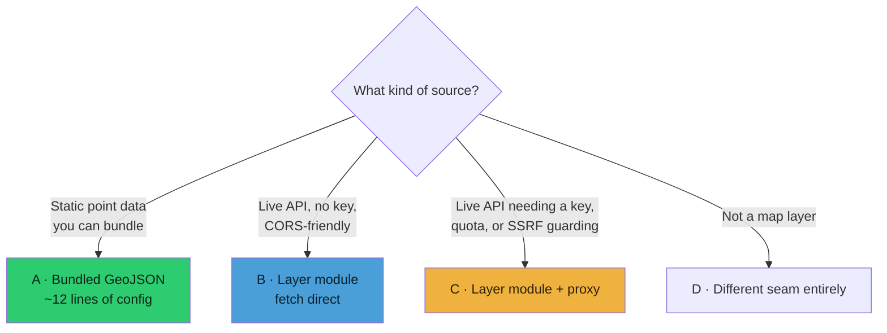
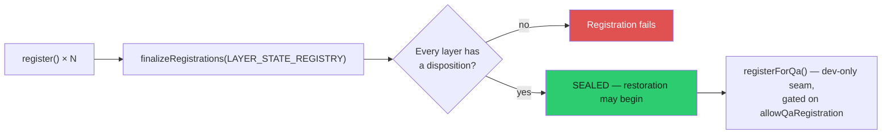

# Modularity and Extending

How pluggable this codebase actually is, where the seams are, and what it costs to
add a new source.

---

## Verdict

**The runtime is genuinely modular. The registry is deliberately centralized.**

A layer is a plain object implementing a small lifecycle contract. It does not know
about the UI, the share-link codec, the detection overlay, or the voice agent — those
discover it. You can write one in isolation and it will slot in.

What is *not* modular is registration. A new layer id must be declared in several
central lists, and one of them **seals at boot** — the manager refuses to finalize if
a registered layer has no serialization disposition. That is a feature, not an
oversight: it makes a half-registered layer impossible. But it means "add a source" is
never a one-file change.

| Dimension | Grade | Why |
|---|---|---|
| Layer runtime contract | **Excellent** | ~7 methods, no framework, no base class |
| Bundled point datasets | **Excellent** | A factory; ~12 lines of config |
| UI integration | **Excellent** | Toggle panel is generated from the registry |
| Server proxies | **Good** | Consistent, copyable patterns; each is hand-written |
| Optional capabilities | **Good** | Opt in by implementing a method |
| Registration | **Fair** | 4–7 touch points, three of them duplicated enums |
| Voice integration | **Fair** | Layer ids hand-listed in three tool schemas plus prose |

---

## The layer contract

A layer is an object. No class, no inheritance.

```js
{
  id: 'earthquakes',              // stable, unique — the registry key
  name: 'Earthquakes (24h)',
  icon: '🌋',
  source: 'USGS',
  updateInterval: 60000,

  init(viewer)     { /* create data sources, hidden */ },
  enable(viewer)   { /* show */ },
  disable(viewer)  { /* hide */ },
  async update(viewer) { /* fetch + render */ },
  destroy(viewer)  { /* full teardown */ },
  getStats()       { /* { count, lastUpdate, error } → feed health */ },
}
```

Registration is one line in `src/main.js`:

```js
dataManager.register(earthquakesLayer);
```

`_registerLayer` enforces only two things: a non-empty string `id`, and that the id
is not already taken.

### Optional capabilities — opt in by implementing

This is the nicest part of the design. Extra behaviour is *discovered*, not declared.

| Implement | And you get |
|---|---|
| `getDetectableObjects({ maxCount, seed })` | Your entities join the detection overlay |
| `registerSpriteCollection(id, collection)` | Ordered sprite compositing (`spriteOrder.js`) |
| `registerDynamicCredit(viewer, credit)` | Attribution appears when the layer activates |
| `attachDataManager(manager)` | Coordinator-style layers that drive siblings |
| `getStats()` returning `error` | An honest `UNAVAILABLE` chip instead of green-over-empty |

No interface declaration, no registration call for these. If the method exists, the
subsystem uses it.

---

## Four ways to add a source



### A — Bundled dataset (easiest by a wide margin)

`createLocalGeoJsonLayer()` in `src/data/localGeojson.js` builds a complete layer —
points, 3D stems, click picking, label decluttering, error handling — from config:

```js
const dams = createLocalGeoJsonLayer({
  id: 'local-dams',
  url: damsUrl,              // import … from './local_data/dams/dams.geojsonl?url'
  name: 'Dams',
  color: '#0088ff',
  icon: '▰',
  source: 'USACE',
  labels: true,
  labelMax: 900,
  labelGridPx: 132,
});
```

Add it to the array in `src/data/localLayers.js` and it registers through the existing
loop in `main.js`. Put the data in `src/data/local_data/<name>/` **with a provenance
README** — every existing pack has one, and `DATA_SOURCES.md` depends on it.

The factory already handles the honesty rules: it guards `response.ok`, reports
`error` + `lastUpdate` through `getStats()`, and commits its Cesium data source only
after setup completes so a partial failure retries on the next enable.

### B — Live keyless API

Write a layer module implementing the contract. Fetch in `update()`. Camera-gate it if
it is viewport-driven. Split pure parsing into a Cesium-free sibling with a
`.test.mjs`.

Go straight to **C** if the upstream has quota worth protecting — most do.

### C — Live API behind a proxy

Add a middleware plugin in `vite.config.js` following the patterns in
[server-proxies.md](server-proxies.md): validate and bound every client input, cap the
response, cache in memory and on disk, sanitize errors, add a budget governor if the
upstream is metered, and never let a client specify an upstream URL.

Put pure parsing in a `src/` module that **both** the proxy and the layer import — that
is why `vite.config.js` imports 13 modules from `src/`. Keep those Cesium-free and
Node-free; `browserModuleBoundary.test.mjs` enforces it.

If it needs a key, add it to the provider registry in `src/keySetupCore.mjs` so the
POWER UP panel and `npm run doctor` both know about it.

### D — Not a layer

| Extension | Where |
|---|---|
| Visual style / shader | `src/styles/` + `StyleManager` in `src/ui.js` |
| Voice tool | Schema in `vite.config.js`, handler in `src/voice/gevActions.js` |
| Cinematic scene | `SCENE_RECIPES` in `src/scenes/recipes.js` |
| Annotation renderer | `src/annotations/` — the hybrid renderer already routes by geometry type |
| Map basemap | `MAP_STACKS` in `src/mapStackController.js` + a chip |

---

## The registration checklist

Every place a new layer id must appear. **This is the real cost of adding a source.**

| # | File | What | Required? |
|---|---|---|---|
| 1 | `src/main.js` | `dataManager.register(layer)` | **Always** |
| 2 | `src/data/layerState.js` | `LAYER_STATE_REGISTRY` entry: unique **single-char token** + `disposition` | **Always — the registry seals** |
| 3 | `vite.config.js` | layer-id enum in `set_layer_visibility` | If voice should control it |
| 4 | `vite.config.js` | layer-id enum in `show_data_layers_menu` | Same |
| 5 | `vite.config.js` | layer-id enum in `get_entity_context` | Same |
| 6 | `vite.config.js` | common-name mapping prose ("fires → local-firms") | If the name is non-obvious |
| 7 | `src/data/spriteOrder.js` | `SPRITE_LAYER_ORDER` | If it draws sprites |
| 8 | `src/data/dataCredits.js` | credit constant | If the source requires attribution |
| 9 | `src/keySetupCore.mjs` | provider entry | If it needs a key |
| 10 | `docs/CURRENT-STATE.md` | Active Data Layers table | **Always** — repo maintenance rule |
| 11 | `DATA_SOURCES.md` | licence + attribution row | **Always** for a new source |

### On the sealing requirement



Restoration starts **only after the complete production registry is sealed**, which is
what stops a share link restoring into a half-built app. Post-seal registration exists
solely as a QA seam (`registerForQa` / `unregisterForQa`), authorized explicitly and
tracked separately.

Dispositions are `enabled-only`, `enabled+options`, or `enabled+mirrored-options` — see
[state-and-sharelinks.md](state-and-sharelinks.md). Tokens are single characters
(`a b c d e f g i m q r s t u w x` are taken), so the share-link namespace is finite
though far from exhausted.

---

## Where the coupling actually is

Three honest criticisms, in order of how much they would annoy you.

**1. The layer-id enum is duplicated three times** in `vite.config.js` — in
`set_layer_visibility`, `show_data_layers_menu`, and `get_entity_context`. Add a layer
and forget one, and voice half-works in a way no test catches. These could be derived
from `REGISTERED_LAYER_IDS`, which `layerState.js` already exports.

**2. Voice knowledge is prose.** The common-name mapping ("ships/vessels/boats →
ais-live-vessels") lives in an instruction string. A new layer with a non-obvious name
needs that string edited, and there is no mechanism reminding you.

**3. `src/ui.js` is 10,310 lines.** The toggle panel is generated, but anything beyond
a standard row means editing the largest file in the project.

Against that, three things are better than most codebases manage: the UI toggle panel
is **built from the registry** rather than hand-written per layer; optional capabilities
are **duck-typed** rather than declared; and the proxy layer's patterns are consistent
enough to copy without reading the whole file.

---

## Worked example — a live keyed point source

Adding, say, a lightning-strike feed:

1. **Proxy** — `lightningProxy()` in `vite.config.js`: bound the viewport query, cap
   the response, 60 s memory cache, sanitize errors, read `LIGHTNING_API_KEY` from
   `process.env`. Register it in the plugin array.
2. **Parser** — `src/data/lightningParse.js`, Cesium-free and Node-free, plus
   `lightningParse.test.mjs`. Import it from **both** the proxy and the layer.
3. **Layer** — `src/data/lightning.js` implementing the contract. Camera-gate
   `update()`. Return honest `getStats()`. Add `getDetectableObjects()` if strikes
   should join the detection mesh. Register a hold **only** if it animates per frame.
4. **Key** — provider entry in `src/keySetupCore.mjs`; it then appears in POWER UP and
   `npm run doctor` with no further work.
5. **Register** — `main.js`, plus a `LAYER_STATE_REGISTRY` entry with a free token.
6. **Voice** — the three enums, plus the name mapping if "lightning" is not obvious.
7. **Attribution** — `dataCredits.js` if required.
8. **Docs** — `CURRENT-STATE.md` layer table, `DATA_SOURCES.md` licence row, and the
   table in [data-layers-reference.md](data-layers-reference.md).

Realistically: **half a day for the layer, half a day for the wiring and docs.**

---

## Gotchas

- **Register a render-governor hold only if you animate per frame.** Otherwise call
  `governorRequestRender()` on discrete change. A `CallbackProperty` is a per-frame
  cost even when its value never changes — see
  [bootstrap-and-rendering.md](bootstrap-and-rendering.md).
- **`getStats()` must report `error`.** A layer that fails silently shows green over an
  empty globe, which the codebase treats as a defect.
- **Do not draw before the manager settles.** The presentation gate keeps sources
  hidden and inert until certain `enabled` — see [layer-system.md](layer-system.md).
- **Check the licence before you bundle.** `DATA_SOURCES.md` opens with the rule: *if
  your use doesn't fit a dataset's license, remove that dataset.*
- **Stay inside the scope boundary.** Events, assets, infrastructure, systems — not
  named-person search, face recognition, or individual tracking.
