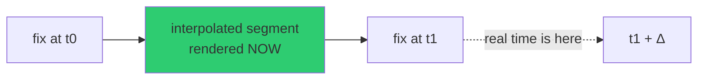

# Motion and Symbology

How moving contacts stay believable between sparse polls, and why several
"obviously wrong" behaviours are deliberate.

Source of record: [`docs/CURRENT-STATE.md`](../docs/CURRENT-STATE.md) §Motion &
Symbology Correctness.

---

## The display latency is intentional

> Flights render **one poll interval behind real time** (30 s civil / 15 s military)
> and interpolate between two known feed-stamped fixes.

**Do not "fix" this away.** It is a product decision. Rendering at the live edge
means extrapolating past the last known fix, which produces visible snapping when
the next poll disagrees. Running one interval behind means every frame sits
*between* two real observations.



Feed timestamps used: OpenSky `time_position`; adsb.lol `receipt − seen_pos`.

---

## Dead reckoning and grace

| Mechanism | Value | Purpose |
|---|---|---|
| Fleet dead-reckoning | ~12 Hz, 1 m² write gating | Motion between polls without thrashing |
| Removal grace | 3 polls, faded icon | A contact that misses one poll is not deleted |
| Epoch-pause coast | ≥ 60 s contact grace | Feed stalls do not empty the sky |
| Absolute ceiling | 5 minutes | Coasting is bounded — a stale contact eventually goes |

**Under source backoff**, each contact and the cockpit are marked `STALE`, and the
cockpit then **holds the exact layer position instead of continuing inertial
flight.** A stale contact must not keep flying convincingly; freezing is the honest
rendering.

A repeated position creates a **forward-only synthetic fix** rather than mutating
history. Grounded history is lifted only when no owned 3D model already controls its
datum.

---

## World-stable icons

Aircraft and ships point along their **true real-world heading** at every camera
angle — tracked or not, looking straight down or across the horizon — via per-frame
screen-space course projection (`src/data/iconOrientation.js`), with horizon
culling.

The failure this prevents: icons that spin as the camera rotates, or lock to the
viewport instead of the world. If you change icon rendering, check it from directly
overhead *and* at a shallow horizon angle — the two cases fail differently.

---

## Sitting on the real ground

Entity heights run through a real vertical datum — geoid-aware, sampled against the
**rendered** terrain mesh (`src/data/geoid.js`, `groundSnap.js`, `groundFloor.js`).
Aircraft park on aprons; cameras stand on street corners rather than floating.

Sampling the *rendered* mesh rather than a nominal ellipsoid is the point: what the
user sees is the surface entities must sit on.

---

## Satellites

SGP4 propagation with orbit rings locked to their satellites via **GMST
realignment** — no drift, no per-second flicker. Positions are *propagated*, not
observed; see [data-layers-reference.md](data-layers-reference.md).

The detection-overlay record cache (`_detectionObjects`) is cleared with the catalog
on every rebuild. It stamps id/class at creation only, and a rebuild can re-tag a
satellite when a partial CelesTrak outage changes which group wins dedupe — so a
stale cache would show a wrong class.

---

## Framing sanity gates

Two geometry gates that exist because of specific failures:

**Off-centre geocode gate.** A viewport that is both bigger than any city
(> 300 km diagonal) *and* not centred on its own geocoded location (anchor > 15% of
the diagonal from the centroid) is replaced by a 40 km metro box on that location.

This is what stops **"Tokyo"** — which geocodes as the *prefecture*, islands and all
— from framing open Pacific.

Two deliberate exemptions: `country` results (several share the pathology via
overseas territories, and reframing a country is a product decision, not a bug fix),
and an explicit `viewMode: 'overview'` ask, so "show me an overview of Hawaii" still
frames the whole administrative area.

**Antimeridian safety.** `flyToViewportBounds` pads from the short-way-round
longitude span and wraps the padded edges. Raw subtraction inflated a 0.41° metro box
to **86.7°**, and a 60° territory to **132°**.

---

## Invariant regression harness

Tracking, model, and detection invariants have a headless real-app harness:

```bash
npm run test:track     # scripts/track-regression.mjs
```

Run it after touching tracking, interpolation, icon orientation, or the ground
datum. Unit tests will not catch a camera-follow regression.
