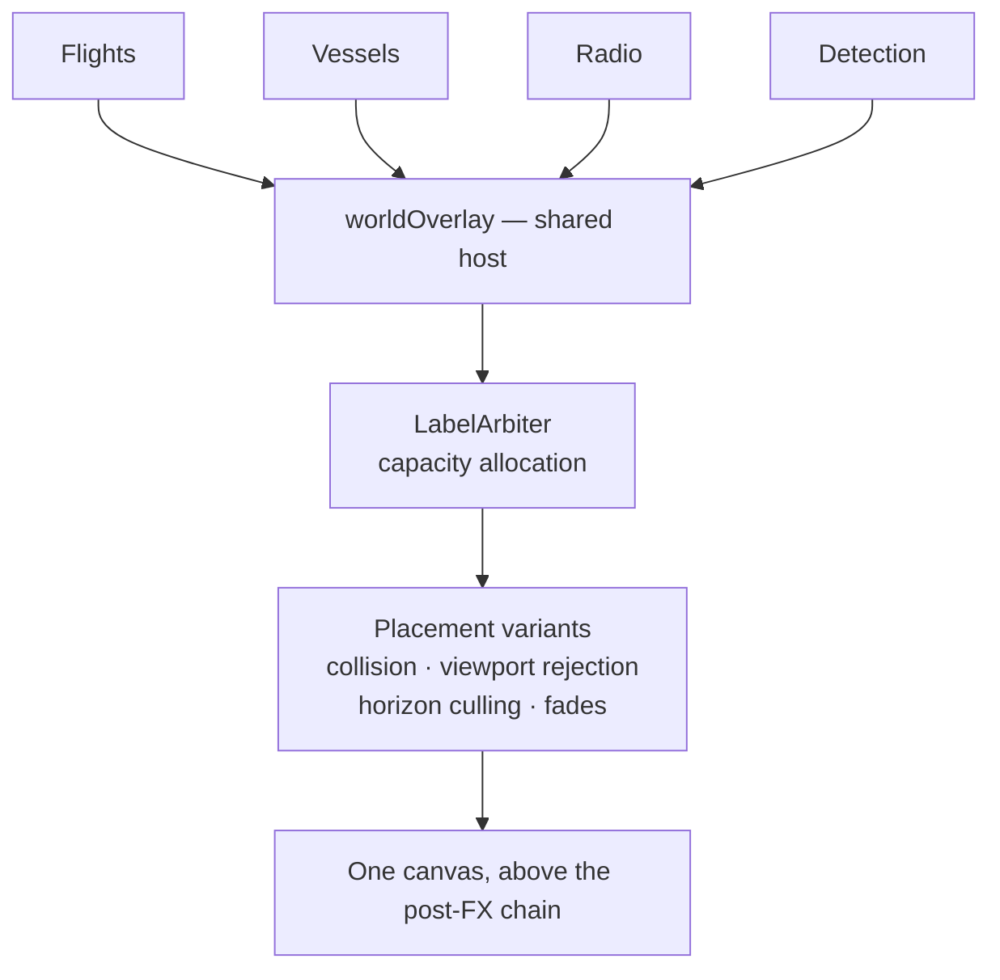
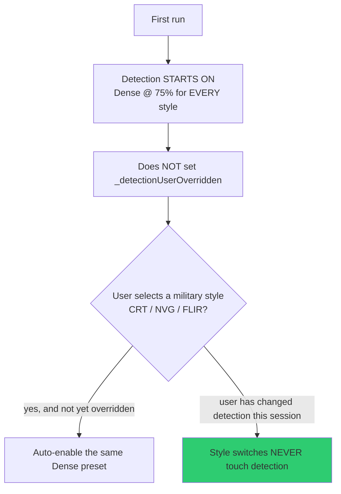

# Overlays and Detection

The screen-space layer that draws labels and bounding boxes over the globe, and the
budget system that stops it becoming noise.

| Module | Lines | Role |
|---|---|---|
| `src/overlays/worldOverlay.js` | 2,364 | Shared overlay host — the canvas everything paints into |
| `src/overlays/worldOverlayDraw.js` | 800 | Measurement and painting primitives |
| `src/data/labelArbiter.js` | 1,125 | Allocates label capacity across layers |
| `src/data/detection.js` | 1,434 | The detection overlay proper |
| `src/data/detectionDraw.js` | — | Label composition, tier resolution |
| `src/data/detectionCohort.js` | — | `BoundedCohort`, `stableIdentityHash` |

---

## Why a shared host

Every layer wants to put text on screen. Left alone they collide, flicker, and
collectively cost more than the globe. So they don't own their own labels — they
publish candidates into one host that owns placement, collision, culling, and
budget.

The canvas sits **above the post-processing chain**, which is why detection tier
colours survive every visual style. Per the design note in `traffic.js`: *"bounding
boxes do the heavy lifting."*

---

## Label arbitration

> Allocate a collective capacity across non-empty layers. Both strategies are
> work-conserving and deterministic; unused entitlement is always borrowed.
> — `labelArbiter.js`

**Work-conserving** matters: a layer with nothing to say lends its budget rather
than wasting it. **Deterministic** matters more — the same scene must produce the
same labels, or capture and QA are impossible.

Radio is the worked example of the caps in practice: ambient labels are nearest-first
through the shared host, capped at **16 globally, 32 at intermediate zoom, 48
nearby**, with cluster and singleton candidates sharing the Radio source's 64-entry
ambient cohort.

---

## The detection overlay

Screen-space bounding boxes and IDs over tracked objects — vehicles, flights,
satellites — rendered through the shared host.

### Density profiles

| Profile | Setting | Cohort |
|---|---|---|
| `OFF` | — | Overlay disabled, canvas hidden |
| `SPARSE` | 0 / 25 | Stable minimum label cohort |
| `BALANCED` | 50 | Stable mixed-layer cohort |
| `DENSE` | 75 / 100 | Broad stable mixed-layer cohort |

Theming comes from `THEME_MAP` presets — retro, surveillance, thermal, default.
External callers (scene transitions, UI) can throttle or **suspend** rendering
without tearing the overlay down.

### The default-and-override rule

Worth understanding before you "fix" the interaction between styles and detection.

Since 2026-08-22 detection starts on — Dense @ 75%, Normal style included — as a
`GLOBAL_POST_DEFAULTS` baseline that deliberately **does not** set
`_detectionUserOverridden`. Selecting a military style auto-enables the same preset,
but only until the user manually changes detection this session; after that, the
override gate is closed permanently for the session.

The principle: **an automatic default may be overwritten by automation; a user
choice may not.**

---

## Identity and cohorts

`BoundedCohort` and `stableIdentityHash` keep label membership stable across frames.
Without stability, labels flicker between candidates every time the cohort is
recomputed — the visual symptom is a "boiling" overlay.

Note the caveat recorded for detection in `CURRENT-STATE.md`: the record cache
stamps id/class at creation only, and a catalog rebuild can re-tag a satellite when
a partial CelesTrak outage changes which group wins dedupe. The cache is therefore
cleared with the catalog on every rebuild.

---

## Known edge, deliberately not redesigned

`CURRENT-STATE.md` records a pre-existing detection edge case under the
reasonable-defaults batch, explicitly left alone rather than reworked. Check that
section before treating detection-density oddities as new bugs.

---

## Performance note

The overlay's allocation path has GC-bracketed microbenchmarks
(`src/overlays/worldOverlayAllocation.test.mjs`, 13 tests) that **only run on the
calibrated Node 24 runtime**. On any other Node major, the runner skips them — see
[testing-and-qa.md](testing-and-qa.md). A `npm test` total quoted without its Node
version is not comparable.
