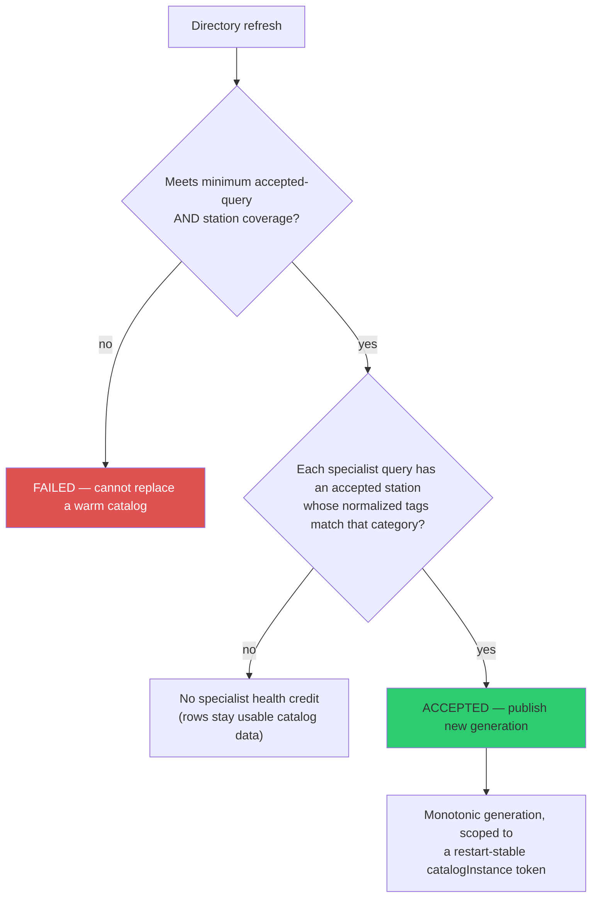
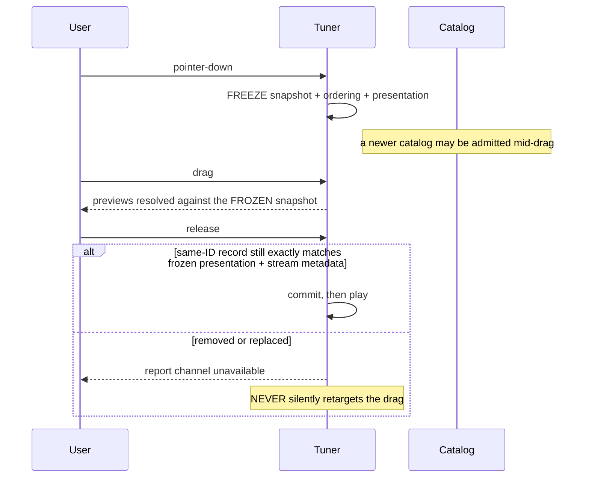

# Radio

Geolocated world radio with an analog tuner. It gets its own document because it
carries **the strictest state contract in the application** — atomic catalog
admission, generation tokens, frozen drag snapshots, and playback ownership epochs.

If you are learning this codebase's concurrency conventions, read this layer.
Everything the manager does in the abstract, Radio does concretely.

| Module | Lines |
|---|---|
| `src/data/radio.js` | 2,876 |
| Proxy | `/api/radio/stations`, `/api/radio/click/:uuid` |
| Source | Radio Browser (public-domain directory) |
| Refresh | 45 min |

---

## Catalog admission is atomic on both sides

Key rules:

- **Schema-valid responses with zero normalized stations count as failed queries**,
  not as successful ones — they cannot inflate refresh health.
- A **partial cold result** is usable but explicitly `DEGRADED`, and has **no
  accepted catalog generation**.
- A partial or malformed refresh **cannot replace a warm catalog**.
- The client independently rejects stale/future freshness metadata, incomplete rows,
  and empty catalogs *as a whole*, preserving its last usable stations with
  `STALE`/`DEGRADED`.

### Generations

Every healthy admission publishes a **monotonically increasing generation** scoped to
a restart-stable `catalogInstance` token — a new server process starts a fresh
sequence, and that is never read as a repeat or a regression.

Snapshots are **deeply immutable**. Stale/degraded warm responses retain the same
generation, so tuner and cluster consumers preserve exact station identity. The
client snapshot holds only a normalized field allowlist, preserves object identity
for an idempotent repeat of the same generation, and **degrades without replacement
if a fresh response presents an older generation.**

> Generation semantics assume the app's actual single-process dev-server deployment;
> concurrent replicas behind one origin are out of scope.

That caveat matters for [deployability.md](deployability.md).

---

## Untrusted metadata

**Snapshot records mark community metadata as untrusted, and Radio tool results omit
station names** so directory text never becomes model instruction context.

One bounded country parser maps recognized ISO codes and English/common names;
malformed, non-ISO, control-containing, and oversized inputs **fail closed**. Literal
or resolved non-global IPv4/IPv6 targets are refused.

---

## The tuner

Exposes the complete current filtered directory, up to **750 stations**, in stable
catalog and filter order.

| Property | Behaviour |
|---|---|
| Needle progress | **Absolute** across the directory — left/centre/right resolve to first/middle/last |
| Snapping | Every position snaps to a real station; there are no selectable static gaps |
| Virtual tape | Bounded; moves left as the needle moves right, faster than the needle, **without DOM nodes for the full directory** |
| Camera movement | **Never** re-ranks or rebuilds the order |

### Drag semantics — frozen at pointer-down

Pointer **cancellation** instead cancels the active preview flight and restores the
exact pre-drag station ordering, absolute position, and a frozen
**presentation-only marker** — without starting a replacement flight, committing, or
autoplaying. That marker is restored even when a concurrent catalog removes the
station, but **never becomes current playback authority.**

A cold degraded fallback may populate the directory and globe, but its null accepted
generation **cannot populate or begin the tuner.**

---

## Presentation gate and lifecycle

Radio obeys the manager presentation gate absolutely. The source, shared overlays,
selected marker, and pick handler stay **hidden and inert** throughout `enabling`,
`disabling`, cancellation, failure, and uncertain reconciliation — activating only
for certain `enabled`.

The same gate rejects, before any state changes:

- direct station selection
- Previous/Next cycling and its camera/fallback preparation
- tuner-static and category-filter mutation
- volume mutation
- every non-Pause playback toggle

Controls present the lifecycle phase and stay non-interactive until certain
`enabled`. When cleanup cannot establish authority, the layer row, player message,
compact status, launch controls, and Data Layers row all show `UNCERTAIN`, and the
accessible labels **name the uncertainty** while Enable/Disable stays available to
reconcile it.

Every `control_radio` result — including status, failure, cancellation, and a missing
module — exposes `lifecycleState` plus `lifecycleUncertain`. Generic
`set_layer_visibility` exposes the same triple for Radio, and realtime suppression
and settlement refresh all three together, so the dedicated and generic routes cannot
publish mixed snapshots.

---

## Playback ownership

Each explicit play attempt owns **one** audio element; replacement retires the prior
one, making its queued callbacks inert. Pause retires the current stream and fallback
attempt, so delayed callbacks from a replaced or paused stream cannot change state or
start another station.

Pause and Stop **settle attempt ownership and authoritative audio state before
synchronous observers run**, so reentrant voice cleanup cannot overwrite a released
stream with a stale paused state.

A later Pause or Stop *provisionally freezes* prepared or started handoff work
without aborting an active Select/Play auto-enable. On semantic success it cancels
the Select/Play lane and clears the frozen handoff; on semantic failure it releases
and resumes it. **Controls commit authority only after semantic success**, so a failed
stronger control cannot suppress a valid completed sibling.

---

## Camera behaviour

- **While any `viewer.trackedEntity` is active**, Previous/Next and tuner previews
  change station and playback **without cancelling or flying the camera.**
- With no tracked entity: a local view whose optical centre remains safely over the
  Earth, or a full globe already contained in the viewport keyhole, uses one direct
  station flight and preserves its initiating angle.
- If a fit-capable Earth disc is clipped/off-centre, Radio first animates a centred
  north-up nadir composition, then focuses from that canonical frame.
- Extreme zoom-out is capped at **13,000 km**, so recovery returns to a useful
  whole-globe scale rather than preserving an empty-space view.
- Tracking acquired *between* the recentre and focus stages suppresses the later
  stage; a delayed fallback rechecks the same live ownership.

**Voice Radio navigation is non-moving.** Explicit station focus is a separate
user-requested route and also yields to a live tracked entity.

---

## Voice semantics

| Phrasing | Action |
|---|---|
| "turn on / start the radio" | Radio **Play** — including when combined with a camera action |
| "show / enable the Radio layer/markers" | Silent **layer-only**; does not close the voice session |
| Qualified request (category, station, country, coords, nearby place) | **Select** — a qualified Play-shaped call is normalized to Select so its criteria cannot be silently ignored |

Successful explicit playback closes an active voice session **only after Radio
reaches `playing`**; a failed stream leaves voice active.

---

## Clusters and labels

At global scale, ambient cluster badges are hard-opacity shared-host entries:
count/category updates and identity replacement skip keyhole and enter/exit ramps.
Their 50,000 km line-of-sight range covers the supported full-globe camera above
24,000 km.

**Cluster identity follows the prior cluster contributing the greatest absolute
number of stations** — preserving majority identity during merges rather than letting
a fully retained minority win. Inheritance is **bilateral mutual-best**: a cluster
accepts only a greatest contributor, and a prior identity transfers only to a
strongest split child. Disjoint clusters receive fresh identity, allocated in
canonical membership order so input permutations do not rename them.

Selected and singleton globe labels use one compact 30-character presentation: a
credible frequency renders first (`93.9 FM — Station`), otherwise the name is
ellipsized. Full names remain in the directory, player, and search state. **No Radio
entity uses native Cesium label text.**

---

## Playback and privacy

Pressing play connects **one browser audio element directly to the broadcaster** and
calls the directory's click counter via known-ID-only `POST /api/radio/click/:uuid`.

**GEV never proxies, caches, records, bundles, or redistributes audio.** Direct
playback exposes the listener's IP to the broadcaster, whose own stream terms apply.
Only MP3/AAC non-HLS rows with public HTTPS targets are returned; favicons are
intentionally omitted.

Radio Browser supplies station-level tags, **not dependable current-song or
programme metadata**, so Radio filtering never claims either.
