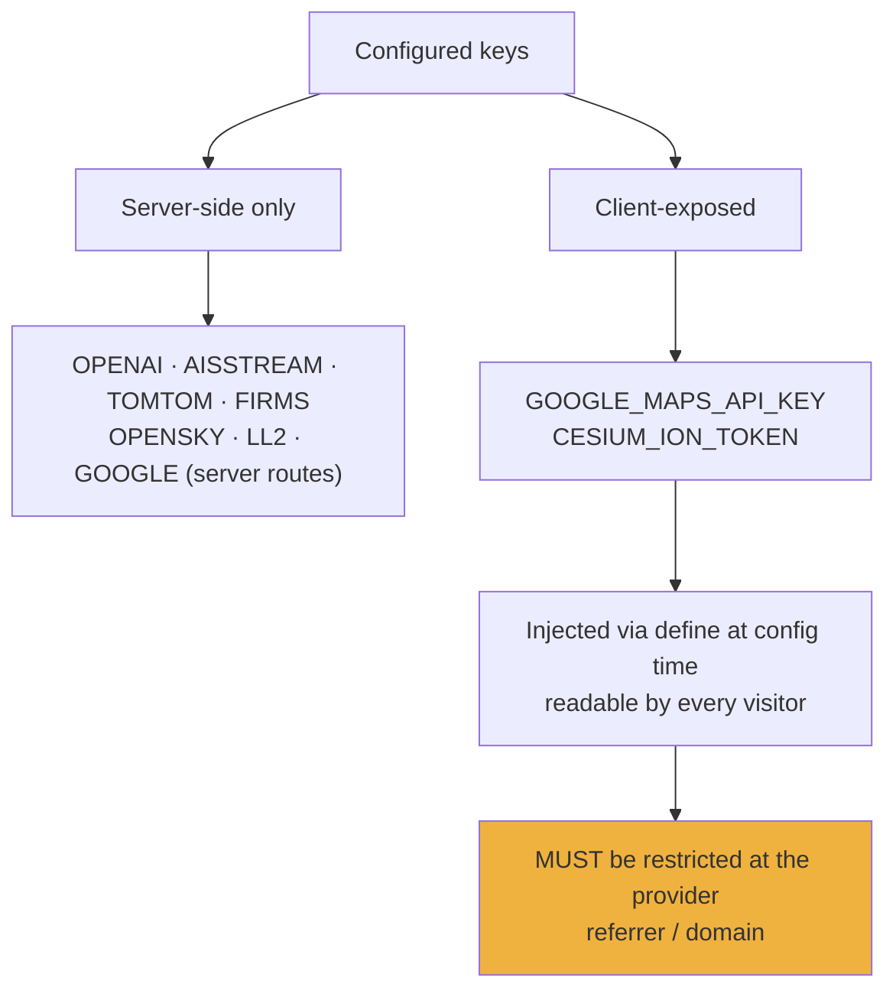
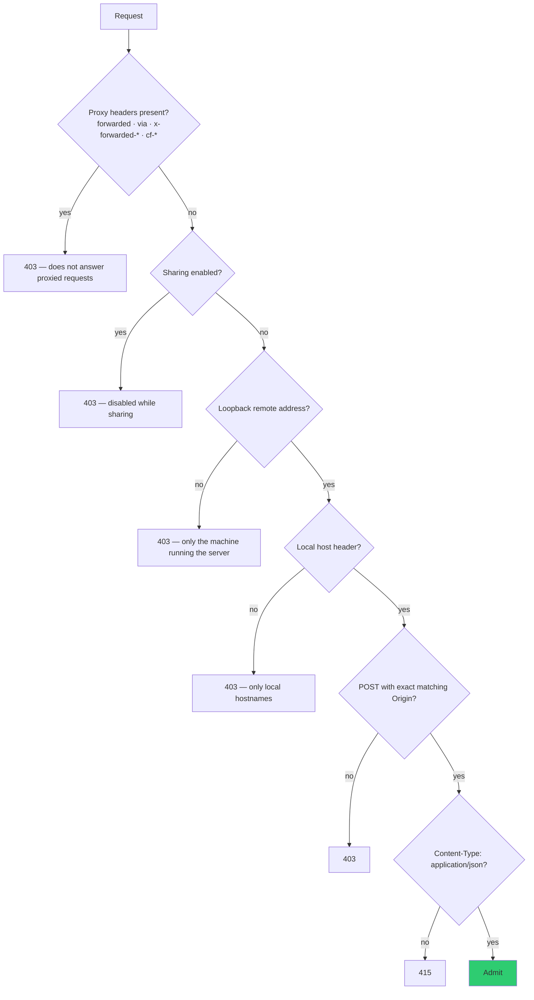

# Security Model

Local-first execution, server-side key custody, and a set of gates that fail closed.
[`SECURITY.md`](../SECURITY.md) is the threat model of record; this is the
implementation view.

---

## Key custody

| Key | Exposure |
|---|---|
| `OPENAI_API_KEY` | Server only. Browser receives **ephemeral Realtime client secrets** from `/api/realtime/token` |
| `AISSTREAM_API_KEY` | Server only. Browser reads the same-origin `/api/ais-live` cache |
| Google (context/annotation) | Server only, via `/api/google/nearby-places` and `/api/google/text-search` |
| `GOOGLE_MAPS_API_KEY` (tiles) | **Client** — SDK requirement |
| `CESIUM_ION_TOKEN` | **Client** — SDK requirement |

The two client-exposed keys are an architectural property, not a defect. Provider-side
restriction is the only control that applies to them.

### Storage

| Path | Store |
|---|---|
| `npm run dev` | repo-root `.env` (gitignored) |
| Pinokio launch | `pinokio/ENVIRONMENT` (gitignored) |
| macOS `dev-fresh.sh` | Keychain |

Which store the panel owns is decided by a launcher marker captured **before** Vite
merges dotenv into `process.env` — so a stray `GEV_LAUNCHER=pinokio` line inside
someone's `.env` cannot silently redirect writes to a store that was never loaded.

Files are permission-hardened **before** a secret is written into them. Both file
stores are **local plaintext**; on macOS the Keychain route is stronger.

> **Do not use Pinokio 8.0.40's native Configure panel.** That release saves this
> nested layout to the wrong path *and logs submitted values.*

### Empty is not unset

A subtle launcher rule worth knowing: an empty string is not "unset" on either side.
`scripts/read-dotenv-value.mjs` hides the requested key from `process.env` for the
duration of the read — Vite's `loadEnv` otherwise lets an inherited empty export win
over the parsed files — and restores it after. A key resolving to nothing is then
removed from the child environment outright (`env -u`), not merely omitted, because
Vite backfills `.env` only over *undefined* variables.

`CCTV_CALTRANS_DISTRICTS` is the documented exception: empty is its kill switch.

---

## Provider Settings admission gate

`admitKeySetupRequest` ([src/keySetupCore.mjs](../src/keySetupCore.mjs)) guards
`/api/setup/status` and `/api/setup/keys`. It is pure and unit-tested; the middleware
only feeds it the request.

**Sharing disables the surface outright rather than trusting the socket.** Tunnelled
traffic reaches the server *from loopback too*, so socket identity cannot carry that
boundary. That is the central insight of this gate.

One deliberate divergence from `scripts/pinokio-preflight.mjs`: preflight treats an
empty `PINOKIO_SHARE_VAR` as sharing-on (fail closed before Start), but the gate
treats a bare/sentinel value as **not** sharing — because that is the normal
git-clone and Pinokio state, and the opposite reading would disable Provider Settings
for every ordinary launch.

### Externally-managed keys

A key supplied from the shell environment or Keychain is **read-only** to the panel
and returns `409`. This guards **replace as well as remove** — a clickjacked or
scripted same-origin POST must not overwrite a live value.

### Store integrity

`readStore()` distinguishes "no store yet" from "cannot read this store". **Only
`ENOENT` means empty.** Every other failure aborts the save, because upserting into a
wrongly-empty string and atomically replacing the file would destroy every other
provider key the user had configured.

The Pinokio store is read with an encoding-aware decoder, so a UTF-16 `ENVIRONMENT`
written by a Windows editor is never mistaken for UTF-8 and corrupted.

---

## Framing protection

`X-Frame-Options: DENY` and `Content-Security-Policy: frame-ancestors 'none'` are set
on **everything the dev server serves** ([vite.config.js:7725](../vite.config.js)),
plus on the setup endpoints themselves.

The rationale, verbatim:

> Framing protection belongs on the APP DOCUMENT, not on API responses: a browser
> evaluates `frame-ancestors` against the framed page's own navigation response.
> Without this, a hostile page could frame `/?setup=1`, align a lure over Provider
> Settings, and have the framed app issue a perfectly same-origin credential write
> that passes every Host/Origin check.

This is why the app **cannot be iframed** — see
[deployability.md](deployability.md).

---

## Filesystem and network guards

| Guard | Detail |
|---|---|
| Vite `server.fs.deny` | `.env`, `.env.*`, `*.{crt,pem}`, `**/.git/**`, `**/ENVIRONMENT` |
| `allowedHosts` | `localhost`, `127.0.0.1`, `.local` unless `HOST` is `0.0.0.0`/`::` |
| Bind | localhost by default; LAN is explicit opt-in |
| SSRF | Redirects rejected; resolved addresses validated as globally routable; TLS pinned to the validated address (Radio) |
| Client-specified upstreams | Refused (CCTV allowlist; Overpass selector bounding) |
| Debug logs | Keys, bearer tokens, client secrets, and image data URLs redacted before disk |

---

## Sharing an instance

Opting into LAN (`--host 0.0.0.0`) means **the server brokers your configured API
keys to anyone who can reach it.** Set `GEV_RATELIMIT_OPENAI_PER_MIN` and
`GEV_RATELIMIT_GOOGLE_PER_MIN` — but understand these are **app-level guards, not
billing caps.** Provider-side budgets are the authoritative control.

Pinokio LAN and Cloudflare sharing are currently unavailable for this launcher: the
supported release **logs successful tunnel-login passcodes**, so the launcher rewrites
both sharing modes to disabled values before preflight, clears the child passcode,
and pins the share trigger to a disabled sentinel. Use a separate reviewed
authentication proxy if remote access is required.

---

## Scope boundary

The project models **events, assets, infrastructure, and systems** — aircraft,
vessels, satellites, fires, cameras, cities. It does **not** build features for
named-person search, face recognition, or tracking individuals, and upstream will not
merge PRs that cross that line.

This is worth holding in a fork too. It is also borne out in the data: the traffic
layer's "vehicles" are synthetic dots over aggregate speed statistics, not tracked
cars — see [data-layers-reference.md](data-layers-reference.md).
