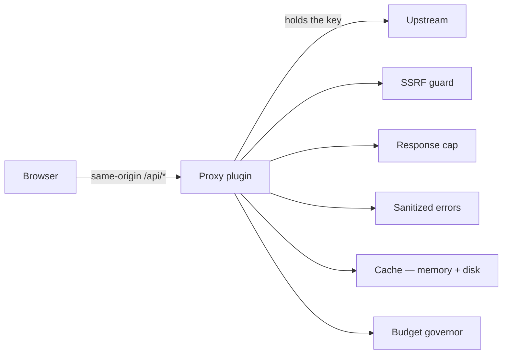

# Server Proxies

`vite.config.js` is 7,741 lines and is **not really a build config — it is the
server.** Every API proxy, cache, and budget governor lives there.

When something involving a network call misbehaves, that file is where the answer
is, not `src/`.

---

## Endpoints

```
/api/adsbdb              /api/launches               /api/realtime/token
/api/adsblol/mil         /api/military-installations /api/regional-brief
/api/adsblol/trace       /api/openai/hud-summary     /api/route
/api/ais-live            /api/opensky                /api/setup/keys
/api/cctv                /api/opensky-track          /api/setup/status
/api/celestrak           /api/overpass               /api/terrain/heights
/api/firms               /api/radio                  /api/tomtom
/api/gbfs                /api/realtime/debug-log     /api/weather-effects
/api/google/nearby-places
/api/google/text-search
```

~20 plugin registrations. **10 also register `configurePreviewServer`** — see
[deployability.md](deployability.md); the rest exist only under `vite dev`.

---

## Why a proxy at all



The browser never sees a private key. Only `GOOGLE_MAPS_API_KEY` and
`CESIUM_ION_TOKEN` are client-exposed, because their SDKs require it.

---

## Shared modules — one source of truth

`vite.config.js` imports **13 modules from `src/`**, so parsing and policy are not
duplicated between client and server:

```js
import { directionToHeading }            from './src/data/directionText.js';
import { filterTrailing24h, parseFirmsCsv } from './src/data/firmsCsv.js';
import { normalizeAdsbLolPointResponse } from './src/data/adsbLolFallback.js';
import { normalizeRadioCountryInput }    from './src/data/radioCountry.js';
import { createAisStreamAdapter, … }     from './src/data/aisStreamAdapter.js';
import { keylessHudSummaryResponse }     from './src/hudSummaryResponse.js';
import { keySetupStatus, … }             from './src/keySetupCore.mjs';
import { VOICE_MODELS, resolveVoiceModel } from './src/voice/voiceCost.js';
// …plus tomtomTiles, regionalBrief, aisWatchdog, terrainHeightsProxy,
//    keySetupHardening
```

These must stay **Cesium-free and Node-free**, and
`src/browserModuleBoundary.test.mjs` fails the build if any browser module imports
`node:*`. Vite only *warns* on such an import while externalizing it, so the stray
survives the build and detonates at runtime — hence the test.

---

## Recurring patterns

Match these when adding a proxy.

### Multi-upstream failover

A mirror list tried in order, first success wins, per-upstream timeout.
`OVERPASS_UPSTREAMS` ([vite.config.js:191](../vite.config.js)) and
`fetchOverpassPayload` are the reference implementation. Note its failure taxonomy:

| Upstream outcome | Handling |
|---|---|
| Rate-limited (429 or body signature) | Remember payload, try next mirror |
| 200 with a runtime-error body | Transient — try next, **do not cache** |
| `>= 500` | Try next |

A 200 carrying an error body is the subtle one; caching it would poison the layer.

### Two-tier caching

Memory (LRU, bounded entries) in front of disk. Three disk caches exist:
`.gev-cache/{overpass,tomtom,military-installations}`.

Disk survives dev-server restarts, which matters because **Vite restarts in-process
on any config change** — including a `.env` write from Provider Settings.

TTLs are chosen from how fast the data actually changes. Overpass road geometry is
24 h in memory / 7 days on disk; the original 45 s TTL forced a mirror round-trip on
nearly every viewport revisit and left nothing to serve when mirrors were down. The
comment names the field test: *"all three mirrors down during US morning peak =
traffic takes forever to load."* Boundary-class queries get **30 days**, since admin
boundaries change ≈never and their pivots are the most expensive queries the app
issues.

### Budget governors

A daily counter persisted to disk. **Over the soft cap, serve stale rather than
spend.** TomTom's is `TOMTOM_DAILY_TILE_BUDGET`, default 40,000 — described in
`DATA_SOURCES.md` as *a configurable application safety ceiling, not a guarantee of
staying within TomTom's monthly free allowance.*

Attempts are counted, not successes: **upstream bills the request either way.**

### Sanitized responses

Errors return a fixed generic message; detail stays in the server log. **Never echo
the upstream URL** — it contains the key.

### Rate limiting

Per-client and global one-minute bounds. `/api/military-installations` uses an
**independent** limiter with the same 90-per-client/300-global bounds, so viewport
installation refreshes never consume `/api/overpass` annotation and traffic capacity.
Opt-in limiters are also available via `GEV_RATELIMIT_*`.

---

## Notable per-proxy behaviour

| Endpoint | Notes |
|---|---|
| `/api/opensky` | Cache stores **successful** responses only; OAuth refresh calls coalesced; independent credit bucket for `/api/opensky-track` |
| `/api/overpass` | Body/response caps, per-client + global limits, concurrency limits, mirror fallback, in-flight dedupe, cache bounds, and **static validation that every selector is spatially bounded** |
| `/api/cctv` | Server-side source allowlist; 8 s abort on still fetches |
| `/api/route` | Bounded OSRM; profile allowlisting, distance caps, response caps, caching, sanitized "no route found" |
| `/api/radio` | Rejects redirects; validates resolved addresses as globally routable (reserved IPv4 and non-global IPv6 excluded); **pins TLS to a validated address** |
| `/api/realtime/token` | Holds `OPENAI_API_KEY`; returns ephemeral client secrets only |
| `/api/realtime/debug-log` | Redacts API keys, bearer tokens, client secrets, and image data URLs **before writing to disk**; bodies size-capped |
| `/api/adsblol/trace` | 60 s cache, 5 MB cap, **ODbL attribution required in UI** |
| `/api/terrain/heights` | Serves stale points when a refresh times out |
| `/api/firms` | Proxy TTL 30 min against a 10 min layer cadence |

---

## Adding a proxy — checklist

1. Register the plugin; decide `configureServer` only, or preview too.
2. Validate and bound every client input — the Overpass selector check is the model.
3. Cap the response.
4. Cache in memory and, if the data is slow-moving, on disk with a justified TTL.
5. Add a budget governor if the upstream is metered.
6. Sanitize errors; log detail server-side.
7. Put pure parsing in a shared `src/` module with a `.test.mjs`.
8. Never let a client specify an upstream URL.
