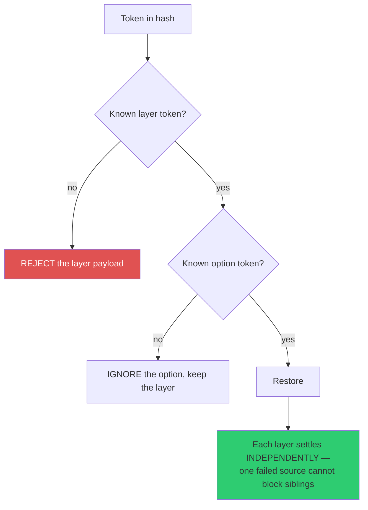
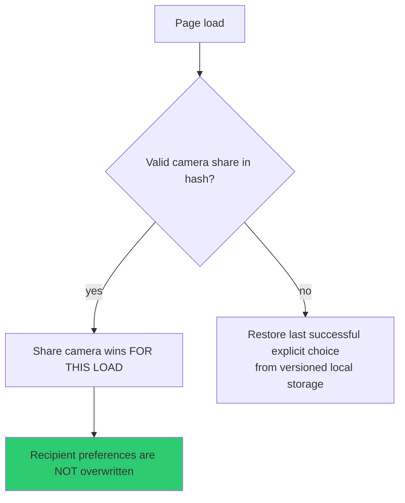

# State and Share Links

Two persistence surfaces: versioned local storage for *your* preferences, and a
deterministic URL hash for *a view you hand to someone else*. They interact, and the
rules governing that interaction are precise.

---

## Share links (v2)

`src/sharelink.js` encodes state into the **URL hash**. The hash is client-side only
— it never reaches the server, so a shared view costs no request and leaks nothing
into logs or proxies.

### What is encoded

| Category | Fields |
|---|---|
| **Always** | camera, visual style, HUD, detection, post-processing, celestial, scope, map stack |
| **Compact fields** | enabled layers, allowlisted layer options, panel state, the active preset's allowlisted shader controls |

Absent layer field → deterministic defaults. **Explicit empty field → no enabled
layers.** Those are different states and are encoded differently.

### The registry seals

The serialization registry **seals only after all 16 production layers register**, and
every layer carries an explicit serialization disposition
(`enabled-only`, `enabled+options`, `enabled+mirrored-options` —
[`layerState.js`](../src/data/layerState.js)).

Unknown *layer* tokens reject the payload; unknown *option* tokens are merely
ignored. The asymmetry is deliberate — an unrecognized layer is a different app
version, an unrecognized option is forward-compatible noise.

### What is deliberately excluded

Only **stable visible options** serialize: aircraft 3D mode, selected civilian and
military flight IDs, satellite catalog and selection, CCTV coverage / projection /
auto-hop, and Radio filter and volume.

Excluded on purpose: playback and tuning, live-data health, calibration, caches,
lifecycle state, temporary Context ownership, and derived effects.

**Radio restore never selects or plays a station.** A link must not start making noise
in someone's browser.

### Identity is never truncated

Tracking IDs are validated as a grammar, not free text — six hex digits for an
ICAO24, with slack for TIS-B (`~abc123`) and similar prefixed forms. Bounding it at
the codec keeps arbitrarily long strings out of durable state, the URL, and local
storage.

> Identity is never TRUNCATED to fit — an out-of-grammar ID is rejected outright,
> because half an address is a DIFFERENT aircraft, not a shorter name for the same
> one. — `layerState.js`

A tracked target in a link is therefore **a handoff, not a bookmark**: it resolves
against live data at open time.

---

## Restore ownership — the lane model

The subtlest machinery in the app. Restoration is split into **lanes**, and a newer
explicit action supersedes **only the field it owns**.

| Lane | Owns |
|---|---|
| Visibility | Which layers are on |
| Option / selection | Per-layer options and selections |
| Camera | Position and follow |
| Visual | HUD, detection, post-processing, scope, celestial |
| Map | Stack |
| Panel | Each panel individually |

Consequences that fall out of this:

- **Navigation cannot turn unrelated layers off.**
- **An option change cannot cancel the same layer's visibility transition.**
- Every explicit HUD, detection, post-processing, scope, or celestial action — from
  UI, keyboard, voice, or the public tool facade — **claims the visual lane before
  mutation.** Invalid requests do not claim the lane and do not partially change
  controls.
- Direct globe pointer and wheel gestures supersede the delayed shared camera and
  selected-subject Follow **without** aborting unrelated layer visibility or
  display-option restoration.

### Precedence on load

A share link changes what you *see now*; it does not rewrite what you have chosen
before.

### One terminal promise

The initial restore has **a single terminal promise** spanning the camera flight,
visual/map/panel callback work, every production layer result, and the
destination-scoped Follow result.

Until it settles: hash writes stay suppressed and the startup screen reads
`Restoring shared view...`. **Destroy settles it as destroyed** rather than permitting
late mutation.

A superseded shared visibility intent follows the authoritative successor chain to a
terminal lifecycle result — including a same-target re-enable or an opposite-target
disable — **before releasing the layer barrier.**

Flights, Military, and Satellite first-update fetches consume the manager
`AbortSignal`; disable and destroy also abort their module-owned feed or dense-catalog
requests.

---

## Local storage keys

Versioned, and the versions are load-bearing.

| Key | Holds |
|---|---|
| `godsEyeView.v8.panelPos.<id>` | Panel positions (**v8**) |
| `godsEyeView.v6.panelCollapsed.<id>` | Collapsed state (**v6**) |
| `godsEyeView.cctv.calibration.v2` | CCTV calibration |
| Scene director project | Scenes, shots, telemetry config |

Notes worth knowing:

- The `v8` position bump performed a **one-time reset** clearing stale DISPLAY
  placements that could overlap the Context rail.
- `godsEyeView.v7.panelPos.<id>` appears in older documentation; legacy
  draggable-panel keys may remain in storage, but **the map-mode right rail ignores
  them**. `DISPLAY` is no longer draggable.
- CCTV calibration `v2` was **wiped clean — no import from `v1`.**
- The retired `k` panel token (MAP STACK) is gone from the share registry, so a legacy
  `ui=k...` link takes the ordinary unknown-token skip.

---

## Implications for changes

1. **Bumping a storage version is a user-visible reset.** Do it deliberately, and say
   so in `CURRENT-STATE.md`.
2. **Adding a layer means adding a serialization disposition** — the registry will not
   seal without one.
3. **Changing a default changes what old links decode to.** Bloom carries an explicit
   `BLOOM_SCALE_VERSION` for exactly this reason; follow that pattern rather than
   silently re-scaling a value.
