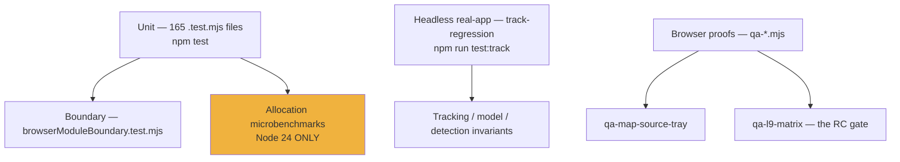

# Testing and QA

[`TESTING.md`](../TESTING.md) is the process document. This is the map of what
exists and what each thing actually catches.

---

## The layers of verification



| Command | Scope |
|---|---|
| `npm test` | Unit suite (`scripts/run-unit-tests.mjs`) |
| `npm run test:track` | Headless real-app tracking regression |
| `npm run qa:map-source-tray` | Browser proof of the Map Source tray |
| `node scripts/qa-l9-matrix.mjs --url …` | The full release-candidate matrix |
| `npm run build` | Build gate |
| `npm run doctor` | Environment and provider readiness |

---

## Unit suite

165 `.test.mjs` files, roughly one per pure module. The convention that makes this
possible: **Cesium-dependent rendering stays in the layer module; decisions move to a
Cesium-free sibling.** `trafficFlowStyle.js` (thresholds, colours) versus
`traffic.js` (primitives) is the clearest pair.

When adding code, a missing test is a gap, not a norm.

### Reading `npm test` totals

**A total quoted without its Node major is not comparable.**

The two GC-bracketed allocation microbenchmarks —
`src/data/focusAllocations.test.mjs` (1 test) and
`src/overlays/worldOverlayAllocation.test.mjs` (13 tests) — **only run on the
calibrated Node 24 runtime.** On any other major the runner skips both files and
their 14 tests are simply absent from the total.

`scripts/run-unit-tests.mjs` exports `ALLOCATION_TEST_FILES` and
`isCalibratedAllocationRuntime()` to make that explicit. This tree runs Node 26, so
**those 14 do not run here.**

### The browser boundary test

`src/browserModuleBoundary.test.mjs` walks every `.js` under `src/` and fails if any
imports a `node:*` core module.

It exists because Vite **externalizes `node:` for the browser and only warns** — a
stray import survives the build and becomes a runtime failure the moment the guard
around it is wrong. Two modules had already done it
(`naturalEarthRegions.js`, `neighborhoodPolygons.js`, reading bundled JSON packs
under `node:test`); an import attribute now serves both runtimes.

This test is what lets `vite.config.js` safely import 13 modules from `src/`.

---

## Headless real-app regression

```bash
npm run test:track      # scripts/track-regression.mjs
```

Drives the real app headlessly and asserts **aircraft tracking, model, and detection
invariants.** Unit tests cannot catch a camera-follow regression, an icon that spins
with the camera, or a model that fails to swap in — this can.

Run it after touching tracking, interpolation, icon orientation, or the ground datum.

---

## Browser proofs

`scripts/qa-map-source-tray.mjs` covers the four-source Map Source tray:
presentation, keyboard disclosure, responsive bounds, unpinned auto-dismiss,
`ACQUIRING` status, and retired/unknown stack-id restore.

```bash
QA_BASE_URL=http://localhost:4173 npm run qa:map-source-tray
QA_BASE_URL=http://localhost:4173 npm run qa:map-source-tray -- --keyless
```

**Both invocations are gates.** `--keyless` forces the no-ion-token expectations even
on a keyed server — otherwise the unavailable-stack behaviour is never exercised.

### The L9 matrix

```bash
node scripts/qa-l9-matrix.mjs --url http://localhost:4173
node scripts/qa-l9-matrix.mjs --list     # manual checks it cannot automate
```

Orchestrates the `qa-*.mjs` fleet plus `track-regression` as subprocesses, adding
repo, feed, and in-browser probes.

**A check whose key the target lacks is SKIPPED with an `OWNER-RUN` tag, not failed.**
That distinction is the point: a keyless machine cannot prove a keyed behaviour, and
pretending otherwise produces either false failures or false confidence. `--list`
prints what a human still has to do.

---

## Pinned behaviours

Some tests exist to pin a *performance* decision rather than a functional one. The
clearest is `src/data/earthquakes.test.mjs`, which pins that quake discs are **static
geometry** — a `CallbackProperty` axis re-tessellated its ground primitive every
frame at 32.4 ms/frame and 30 fps on the shipped 58-event feed.

Treat these as regressions-in-waiting: the code looks harmless, the test explains why
it is not.

Similar CCTV floor pins are documented in [cctv.md](cctv.md) — zero samples for
heading-only edits, zero transient samples during E/N drag, one shared-floor
resolution on release.

---

## Capture and analysis tooling

`tools/` — not tests, but the harnesses behind the media and calibration work.

| Tool | Purpose |
|---|---|
| `cesium-render.mjs` | Headless Cesium render capture via Puppeteer |
| `streetview-panorama.mjs` | Street View tile panorama stitcher |
| `streetview-headings.mjs` | Heading sweep capture, supports neighbour traversal |
| `pano-pinhole.mjs` | Equirectangular → pinhole reprojection |
| `sat-ortho.mjs` | Map Tiles ortho stitch and centred crop with georef corners |

`puppeteer` and `sharp` are the dependencies behind these. Note that npm's
allow-scripts policy may block their postinstall — if a harness fails to launch, run
`npm approve-scripts puppeteer` before debugging further.

---

## The documentation gate

`CURRENT-STATE.md` closes with a rule that functions as a review criterion:

> When runtime behavior or architecture changes, update this file in the same change
> set as code updates.

A behaviour change without a `CURRENT-STATE.md` update is an incomplete change set.
