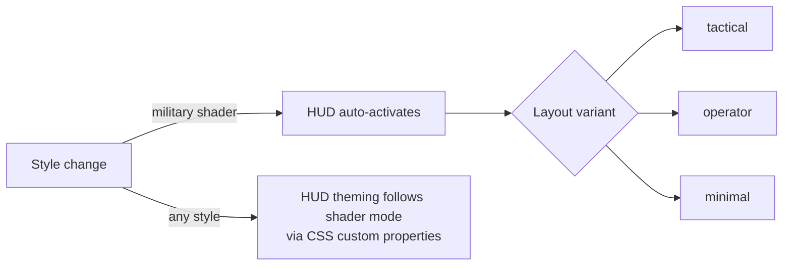

# Visual Styles and HUD

The "reskin reality" layer — GLSL sensor looks over the live globe — and the
intelligence HUD that rides with them.

---

## The style set

Six shader modules in `src/styles/`, driven by `StyleManager` in `src/ui.js`:

| Module | Look |
|---|---|
| `retro.js` | CRT |
| `surveillance.js` | Night vision (NVG) |
| `thermal.js` | FLIR / thermal (incl. Ironbow) |
| `noir.js` | Noir |
| `snow.js` | Snow |
| `anime.js` | Anime |

Bound to keys `1`–`7`. Styles apply to the whole live planet — the data keeps
running underneath, which is the entire point: you are switching *sensors*, not
switching to a picture.

---

## Post-processing

`src/bloom.js` owns bloom intensity with an explicit **scale version**
(`BLOOM_SCALE_VERSION`) alongside `bloomStrengthFromIntensity`,
`clampBloomIntensity`, and `decodeBloomIntensity`.

The version exists because bloom values ship in share links. When the scale is
re-tuned, an old link must not silently mean something different — the codec
handles the migration instead of the value quietly changing meaning.

Global post defaults are documented in `CURRENT-STATE.md` §Current Global Post
Defaults, including a batch dated 2026-08-22 and revised 2026-08-24 (superseding
interim 8%/3% values).

### Defaults have three surfaces — and a parse fallback that is not one

`CURRENT-STATE.md` is emphatic about this, and it is the thing most likely to trip
you:

> **A default has THREE surfaces, and a PARSE fallback that is not one of them.**
> **They do NOT all persist the same way, and only one of them persists at all.**

Before changing a default, read that section. Changing the constant is not the same
as changing the default a user experiences, and neither is the same as changing what
an old share link decodes to.

---

## The HUD

`src/hud.js` — *Intelligence HUD Overlay, NRO/NGA satellite aesthetic.*

Renders reconnaissance metadata over the Cesium canvas at configurable cadences:

- Classification banners
- Live MGRS and lat/lon coordinates
- Sensor metrics — **GSD**, **NIIRS**, **ONA**
- Timestamps and orbital data

**It auto-activates when a military-style shader is selected** (NVG, FLIR, CRT).
Colour theming is driven by the active shader mode via CSS custom properties, so
the HUD matches the sensor rather than fighting it.

Three layout variants: **tactical**, **operator**, **minimal**.

---

## AI HUD summary

A terse, five-word intelligence-style readout of the current view that regenerates
as the camera moves. Requires an OpenAI key — the same one voice uses — and is
brokered through `/api/openai/hud-summary`.

Keyless, `src/hudSummaryResponse.js` supplies `keylessHudSummaryResponse`; the
feature is absent rather than broken. That module is imported by `vite.config.js`
too, so client and server agree on the keyless shape — see the shared-module
pattern in [server-proxies.md](server-proxies.md).

---

## UI shell notes

The runtime UI lives in `src/ui.js` (10,310 lines — the largest module in the
project, holding panels, HUD wiring, styles, and the control facade).

Layout facts worth knowing, from `CURRENT-STATE.md` §UI/UX Runtime Defaults:

| Concern | Value |
|---|---|
| Z ladder | panels 100–139 (renormalized on wrap) · voice pill 150 · toast 200 · clean-view exit 300 |
| Panel **position** keys | `godsEyeView.v8.panelPos.<id>` |
| Panel **collapsed** keys | `godsEyeView.v6.panelCollapsed.<id>` |
| Right rail | `#right-context-rail` — `DISPLAY`, `CCTV`, parameters, `GLOBAL CONTEXT`, in that order |
| Rail width | 176 px compact buttons, 50 px height, 52 px edge inset; 330 px expanded |

`DISPLAY` (formerly "MOVE") groups HUD, DETECT, Bloom, Sharpen, 3D, Clean-UI. It is
**no longer draggable** and legacy saved coordinates are ignored. `DISPLAY` may
remain open beside one contextual panel; **CCTV and Context are mutually
exclusive.**

The most recently opened right-rail panel owns the constrained lane **even when it
appears later in DOM order** — and passive restoration or automatic disclosure does
not replace that explicit owner. That rule prevents a restore from stealing the lane
from something the user just opened.

A dock popover auto-dismisses on mouse-away unless pinned. Focus defers dismissal
only when the browser reports `:focus-visible` — keyboard focus holds the tray open,
a mouse-clicked tile does not, because Chromium focuses a `<button>` on press.
