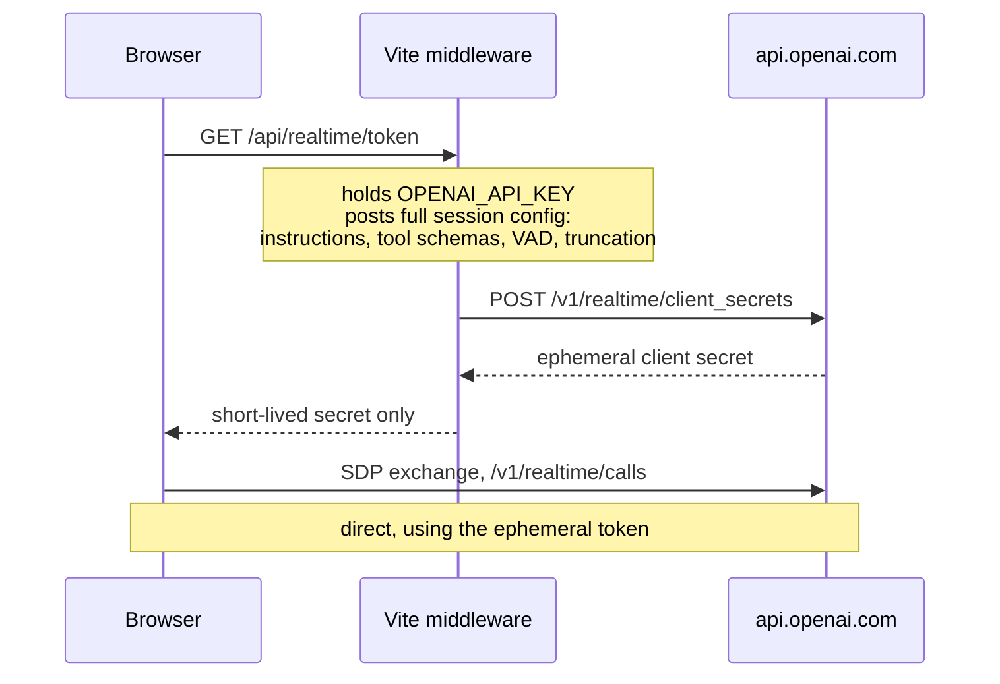
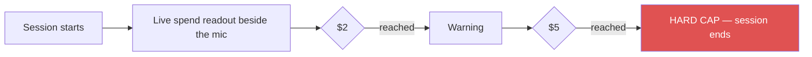

# Voice and Actions

`GEV MIC` starts an OpenAI Realtime session over WebRTC. The app becomes
hands-free, and the agent gets 28 tools against the live scene.

| Module | Lines | Role |
|---|---|---|
| `src/voice/gevRealtime.js` | 2,610 | Session lifecycle, transport, status |
| `src/voice/gevActions.js` | 3,459 | Tool execution against the live app |
| `src/voice/voiceCost.js` | — | Model tiers, cost tracking, limits |

---

## Token flow — the key never reaches the browser

Two consequences: `OPENAI_API_KEY` is **server-side only**, and the session config —
including the tool schemas and instructions — is authored server-side in
`vite.config.js`, not in client code the user could edit.

---

## Session defaults

Env-tunable, per `CURRENT-STATE.md`:

| Setting | Value |
|---|---|
| Model | `gpt-realtime-2`, or `gpt-realtime-2.1-mini` on the MINI tier |
| Voice | `marin` |
| Reasoning effort | `low` |
| Turn detection | Semantic VAD, low eagerness |
| Response interruption | Off |
| Context window | ~3,000 post-instruction tokens, 0.5 retention ratio |

**The conversational window is deliberately short because map state is fetched live
per turn.** The agent does not remember the scene; it re-reads it. That is cheaper
and more accurate than carrying stale state in context.

---

## The 28 tools

Schemas server-side in `vite.config.js`; execution client-side in `gevActions.js`.

| Group | Tools |
|---|---|
| **Camera** | `fly_to_location` · `adjust_camera_zoom` · `zoom_to_globe` · `move_camera` · `fly_route` · `frame_overhead` |
| **Tracking** | `select_nearest_aircraft` · `track_entity` · `stop_tracking` · `control_cockpit` |
| **Layers & panels** | `set_layer_visibility` · `show_data_layers_menu` · `set_panel_open` · `set_context_mode` |
| **Presentation** | `set_visual_style` · `set_hud` · `set_detection` · `set_post_processing` · `set_map_stack` |
| **Content** | `control_cctv` · `control_radio` · `control_scene` |
| **Annotation** | `annotate_map` · `clear_annotations` |
| **Query** | `get_entity_context` · `get_current_view_state` · `analyst_query` · `next_iss_pass` |

### Dispatch invariants

From `createGevActionRunner` (`gevActions.js:290`), in the order they are checked:

1. **Navigation interrupts continuous camera motion** — checked *first*, because each
   handler returns.
2. **Explicit navigation while tracking supersedes the follow camera.** Without this,
   the tracker drags the view back and you get the field finding: *"I flew there but
   can't do anything."* `track_entity` manages its own handoff.
3. **Zoom during an active orbit adjusts the orbit radius** (spiral in/out) rather
   than moving the camera — a straight move would be snapped back by the per-frame
   `lookAt`. Factors: `little` 1.25 · `medium` 1.6 · `lot` 2.4.

---

## Honesty rules

The agent is constrained to reflect reality, not to sound successful:

- **It only confirms actions that succeeded.** Partial failures, approximate
  synthesized zones, and route fallbacks come back as *structured tool results* so
  the voice layer can be honest about them.
- **Visual grounding does not invent labels.** At street level it reads a viewport
  screenshot to identify legible signage and building names, and is instructed never
  to hallucinate them.
- **Radio tool results omit station names**, so community-supplied directory text
  never becomes model instruction context. Snapshot records mark community metadata
  as untrusted.

That last one is a prompt-injection control, and it generalizes: **data fetched from
third parties must not flow into the model as instructions.**

---

## Cost governance

Realtime audio is the only meaningfully metered path in the app.

Plus an STD/MINI model toggle, and the short context window above. Limits live in
`voiceCost.js` (`VOICE_COST_LIMITS`, `normalizeCostLimits`, `serializeCostLimits`)
and are imported by `vite.config.js` too, so both sides agree.

**These are client-side session controls, not billing caps.** Set an OpenAI usage
limit as the real backstop.

---

## Cancellation and turn ownership

Concurrency here is genuinely hard — a user can interrupt mid-tool, and tools mutate
layers that have their own lifecycle transactions.

- **Only a newer user turn or session teardown aborts the complete active-tool set.**
- A cancelled turn **cannot publish a late request** — an interrupted or superseded
  turn aborts pending resolution before it can enable a layer or select a station.
- Dedicated controls and generic `set_layer_visibility` both forward cancellation,
  and they share one ownership domain, so an older action cannot reverse a newer one.
- Once an exact voice visibility intent **commits**, a newer turn cannot relabel it
  as cancelled; pre-commit aborts remain cancellable, and final lifecycle mismatches
  remain failures.

See [layer-system.md](layer-system.md) for the epoch machinery underneath, and
[radio.md](radio.md) for the most demanding instance of it.

---

## Without a key

The whole app still runs. The mic button reports voice unavailable. The AI HUD
summary is likewise absent rather than broken.
